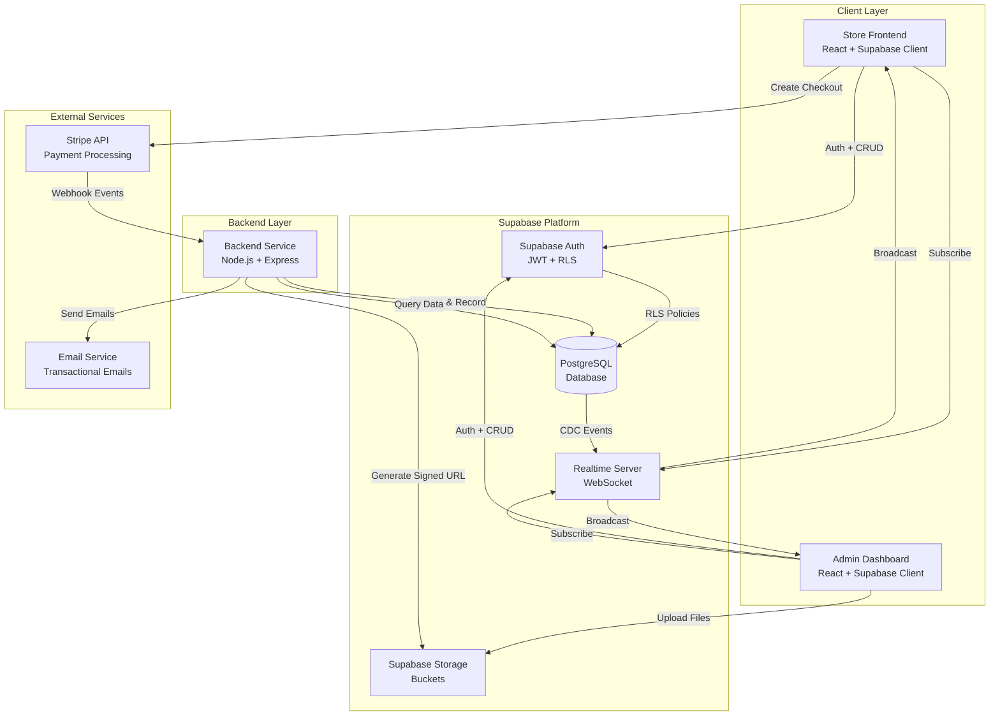
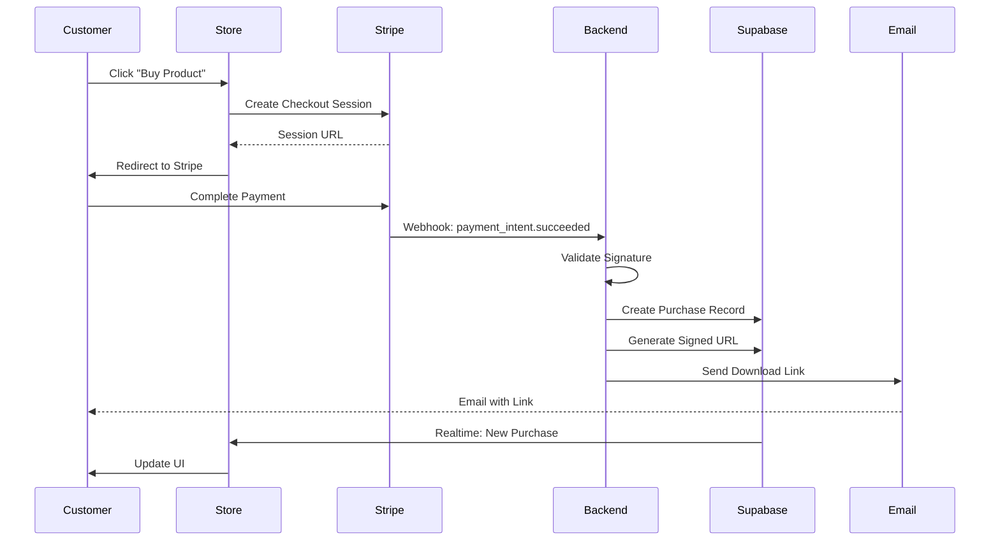
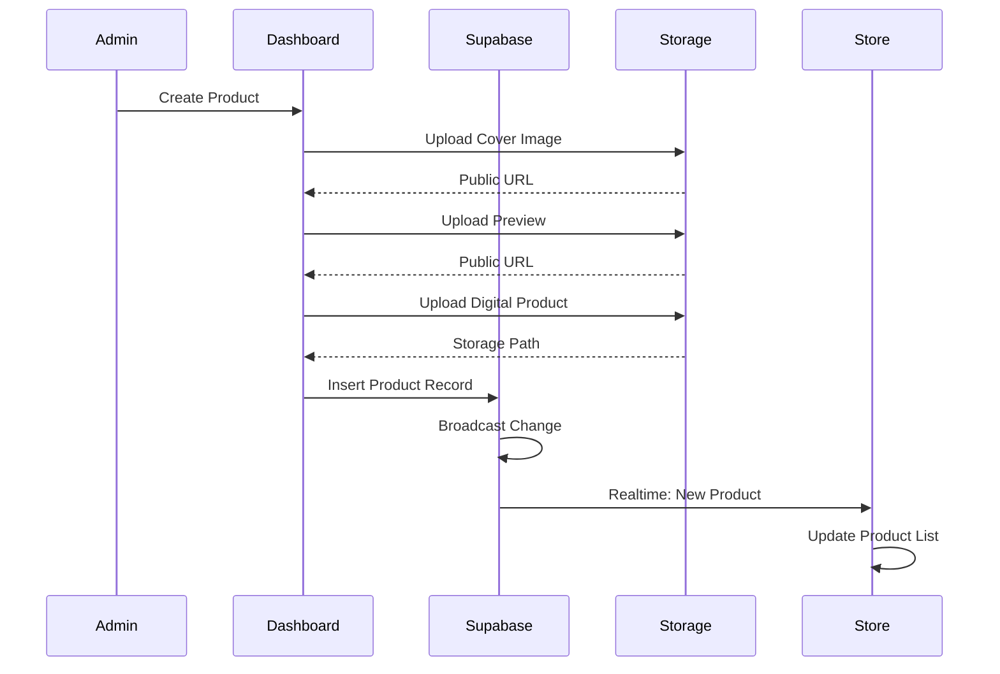
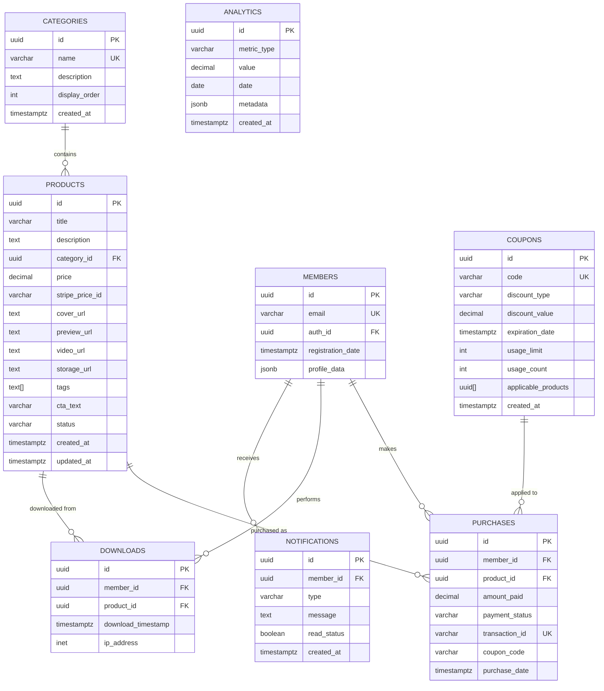

# Design Document: AI Knowledge Store Platform

## Overview

A plataforma AI Knowledge Store é um sistema de e-commerce para produtos digitais construído com arquitetura moderna e escalável. O sistema é composto por três componentes principais que se comunicam através do Supabase como hub central:

1. **Store Frontend** - Aplicação React/TypeScript para navegação e compra de produtos
2. **Admin Dashboard** - Aplicação separada para gerenciamento administrativo
3. **Backend Service** - Serviço Node.js para processamento de webhooks e automações

### Key Design Principles

- **Security First**: RLS policies em todas as tabelas, validação de webhooks, signed URLs para conteúdo privado
- **Real-time Sync**: Supabase Realtime para sincronização automática entre Admin e Store
- **Separation of Concerns**: Frontend, Admin e Backend como aplicações independentes
- **Idempotency**: Processamento de webhooks e transações com proteção contra duplicação
- **Scalability**: Arquitetura stateless, connection pooling, lazy loading

### Technology Stack

**Frontend (Store & Admin)**
- React 19 + TypeScript
- Vite (build tool)
- Tailwind CSS
- Supabase JS Client
- React Router

**Backend Service**
- Node.js + Express
- TypeScript
- Stripe Node SDK
- Supabase Admin Client

**Infrastructure**
- Supabase (PostgreSQL + Auth + Storage + Realtime)
- Stripe (Payment Processing)
- Email Service (Resend, SendGrid, ou similar)

**Testing**
- Vitest (unit tests)
- fast-check (property-based testing)
- Playwright (e2e tests)

---

## Architecture

### System Architecture Diagram



### Data Flow Diagrams

#### Purchase Flow



#### Product Management Flow



### Component Architecture

#### Store Frontend Components

```
src/
├── components/
│   ├── layout/
│   │   ├── NavBar.tsx
│   │   ├── Footer.tsx
│   │   └── Background3D.tsx
│   ├── products/
│   │   ├── ProductCard.tsx
│   │   ├── ProductList.tsx
│   │   ├── ProductDetail.tsx
│   │   ├── ProductPreview.tsx
│   │   └── VideoPlayer.tsx
│   ├── checkout/
│   │   ├── CheckoutButton.tsx
│   │   └── CouponInput.tsx
│   └── member/
│       ├── MemberArea.tsx
│       ├── PurchaseHistory.tsx
│       ├── DownloadList.tsx
│       └── NotificationPanel.tsx
├── pages/
│   ├── Home.tsx
│   ├── Library.tsx
│   ├── Product.tsx
│   ├── MemberDashboard.tsx
│   └── Auth.tsx
├── lib/
│   ├── supabase.ts
│   ├── stripe.ts
│   ├── realtime.ts
│   └── utils.ts
└── types/
    ├── product.ts
    ├── purchase.ts
    └── member.ts
```

#### Admin Dashboard Components

```
admin/
├── components/
│   ├── layout/
│   │   ├── AdminNav.tsx
│   │   └── Sidebar.tsx
│   ├── products/
│   │   ├── ProductForm.tsx
│   │   ├── ProductTable.tsx
│   │   ├── FileUploader.tsx
│   │   └── ProductEditor.tsx
│   ├── analytics/
│   │   ├── SalesDashboard.tsx
│   │   ├── RevenueChart.tsx
│   │   ├── TopProducts.tsx
│   │   └── DownloadStats.tsx
│   ├── coupons/
│   │   ├── CouponForm.tsx
│   │   └── CouponList.tsx
│   └── categories/
│       ├── CategoryForm.tsx
│       └── CategoryList.tsx
├── pages/
│   ├── Dashboard.tsx
│   ├── Products.tsx
│   ├── Analytics.tsx
│   ├── Coupons.tsx
│   ├── Categories.tsx
│   └── Logs.tsx
├── lib/
│   ├── supabase-admin.ts
│   ├── storage.ts
│   └── analytics.ts
└── types/
    └── admin.ts
```

#### Backend Service Structure

```
backend/
├── src/
│   ├── webhooks/
│   │   ├── stripe-handler.ts
│   │   └── signature-validator.ts
│   ├── services/
│   │   ├── purchase-service.ts
│   │   ├── email-service.ts
│   │   ├── storage-service.ts
│   │   └── analytics-service.ts
│   ├── parsers/
│   │   ├── product-parser.ts
│   │   └── purchase-parser.ts
│   ├── printers/
│   │   ├── product-printer.ts
│   │   └── purchase-printer.ts
│   ├── middleware/
│   │   ├── error-handler.ts
│   │   └── logger.ts
│   └── utils/
│       ├── supabase-client.ts
│       └── retry.ts
├── tests/
│   ├── unit/
│   ├── integration/
│   └── properties/
└── server.ts
```

---

## Components and Interfaces

### Core Interfaces

#### Product Interface

```typescript
interface Product {
  id: string;
  title: string;
  description: string;
  category_id: string;
  price: number;
  stripe_price_id: string;
  cover_url: string;
  preview_url: string | null;
  video_url: string | null;
  storage_url: string;
  tags: string[];
  cta_text: string;
  status: 'draft' | 'active' | 'archived';
  created_at: string;
  updated_at: string;
}

interface ProductWithCategory extends Product {
  category: Category;
}
```

#### Purchase Interface

```typescript
interface Purchase {
  id: string;
  member_id: string;
  product_id: string;
  amount_paid: number;
  payment_status: 'pending' | 'completed' | 'failed' | 'refunded';
  transaction_id: string;
  coupon_code: string | null;
  purchase_date: string;
}

interface PurchaseWithDetails extends Purchase {
  product: Product;
  member: Member;
}
```

#### Member Interface

```typescript
interface Member {
  id: string;
  email: string;
  auth_id: string;
  registration_date: string;
  profile_data: {
    name?: string;
    avatar_url?: string;
  };
}
```

#### Category Interface

```typescript
interface Category {
  id: string;
  name: string;
  description: string;
  display_order: number;
  created_at: string;
}
```

#### Coupon Interface

```typescript
interface Coupon {
  id: string;
  code: string;
  discount_type: 'percentage' | 'fixed';
  discount_value: number;
  expiration_date: string;
  usage_limit: number;
  usage_count: number;
  applicable_products: string[] | null; // null = all products
}
```

### API Interfaces

#### Store Frontend API

```typescript
// Supabase Client Operations
interface StoreAPI {
  // Products
  getProducts(): Promise<Product[]>;
  getProductById(id: string): Promise<Product>;
  searchProducts(query: string): Promise<Product[]>;
  filterByCategory(categoryId: string): Promise<Product[]>;
  
  // Checkout
  createCheckoutSession(productId: string, couponCode?: string): Promise<string>;
  
  // Member
  getPurchases(memberId: string): Promise<Purchase[]>;
  requestDownloadLink(purchaseId: string): Promise<string>;
  
  // Realtime
  subscribeToProducts(callback: (payload: any) => void): RealtimeChannel;
  subscribeToPurchases(memberId: string, callback: (payload: any) => void): RealtimeChannel;
}
```

#### Admin Dashboard API

```typescript
interface AdminAPI {
  // Products
  createProduct(product: Omit<Product, 'id' | 'created_at' | 'updated_at'>): Promise<Product>;
  updateProduct(id: string, updates: Partial<Product>): Promise<Product>;
  deleteProduct(id: string): Promise<void>;
  
  // Storage
  uploadFile(bucket: string, path: string, file: File): Promise<string>;
  deleteFile(bucket: string, path: string): Promise<void>;
  
  // Categories
  createCategory(category: Omit<Category, 'id' | 'created_at'>): Promise<Category>;
  updateCategory(id: string, updates: Partial<Category>): Promise<Category>;
  
  // Coupons
  createCoupon(coupon: Omit<Coupon, 'id' | 'usage_count'>): Promise<Coupon>;
  updateCoupon(id: string, updates: Partial<Coupon>): Promise<Coupon>;
  
  // Analytics
  getSalesStats(): Promise<SalesStats>;
  getTopProducts(): Promise<ProductStats[]>;
  getDownloadStats(): Promise<DownloadStats>;
}
```

#### Backend Service API

```typescript
interface BackendAPI {
  // Webhooks
  handleStripeWebhook(req: Request, res: Response): Promise<void>;
  
  // Purchase Processing
  processPurchase(data: PurchaseData): Promise<Purchase>;
  generateDownloadLink(purchaseId: string): Promise<string>;
  
  // Email
  sendPurchaseConfirmation(purchase: Purchase): Promise<void>;
  sendDownloadLink(email: string, link: string, product: Product): Promise<void>;
}
```

### Parser and Printer Interfaces

#### Product Parser/Printer

```typescript
interface ProductParser {
  parse(data: unknown): Result<Product, ParseError>;
  validate(product: Product): Result<Product, ValidationError>;
}

interface ProductPrinter {
  print(product: Product): ProductMetadata;
  format(product: Product): string;
}

type Result<T, E> = { success: true; value: T } | { success: false; error: E };
```

#### Purchase Parser/Printer

```typescript
interface PurchaseParser {
  parse(data: unknown): Result<Purchase, ParseError>;
  validate(purchase: Purchase): Result<Purchase, ValidationError>;
}

interface PurchasePrinter {
  print(purchase: Purchase): PurchaseRecord;
  format(purchase: Purchase): string;
}
```

---

## Data Models

### Database Schema (PostgreSQL)

#### Complete SQL Schema

```sql
-- Enable UUID extension
CREATE EXTENSION IF NOT EXISTS "uuid-ossp";

-- Enable RLS
ALTER DATABASE postgres SET "app.jwt_secret" TO 'your-jwt-secret';

-- ============================================
-- CATEGORIES TABLE
-- ============================================
CREATE TABLE categories (
  id UUID PRIMARY KEY DEFAULT uuid_generate_v4(),
  name VARCHAR(100) NOT NULL UNIQUE,
  description TEXT,
  display_order INTEGER NOT NULL DEFAULT 0,
  created_at TIMESTAMPTZ NOT NULL DEFAULT NOW()
);

CREATE INDEX idx_categories_display_order ON categories(display_order);

-- ============================================
-- PRODUCTS TABLE
-- ============================================
CREATE TABLE products (
  id UUID PRIMARY KEY DEFAULT uuid_generate_v4(),
  title VARCHAR(255) NOT NULL,
  description TEXT NOT NULL,
  category_id UUID NOT NULL REFERENCES categories(id) ON DELETE RESTRICT,
  price DECIMAL(10, 2) NOT NULL CHECK (price >= 0),
  stripe_price_id VARCHAR(255) NOT NULL,
  cover_url TEXT NOT NULL,
  preview_url TEXT,
  video_url TEXT,
  storage_url TEXT NOT NULL,
  tags TEXT[] DEFAULT '{}',
  cta_text VARCHAR(100) NOT NULL DEFAULT 'Comprar Agora',
  status VARCHAR(20) NOT NULL DEFAULT 'draft' CHECK (status IN ('draft', 'active', 'archived')),
  created_at TIMESTAMPTZ NOT NULL DEFAULT NOW(),
  updated_at TIMESTAMPTZ NOT NULL DEFAULT NOW()
);

CREATE INDEX idx_products_category ON products(category_id);
CREATE INDEX idx_products_status ON products(status);
CREATE INDEX idx_products_created_at ON products(created_at DESC);
CREATE INDEX idx_products_tags ON products USING GIN(tags);

-- Full-text search index
CREATE INDEX idx_products_search ON products USING GIN(
  to_tsvector('portuguese', title || ' ' || description)
);

-- ============================================
-- MEMBERS TABLE
-- ============================================
CREATE TABLE members (
  id UUID PRIMARY KEY DEFAULT uuid_generate_v4(),
  email VARCHAR(255) NOT NULL UNIQUE,
  auth_id UUID NOT NULL UNIQUE REFERENCES auth.users(id) ON DELETE CASCADE,
  registration_date TIMESTAMPTZ NOT NULL DEFAULT NOW(),
  profile_data JSONB DEFAULT '{}'::jsonb
);

CREATE INDEX idx_members_email ON members(email);
CREATE INDEX idx_members_auth_id ON members(auth_id);

-- ============================================
-- PURCHASES TABLE
-- ============================================
CREATE TABLE purchases (
  id UUID PRIMARY KEY DEFAULT uuid_generate_v4(),
  member_id UUID NOT NULL REFERENCES members(id) ON DELETE CASCADE,
  product_id UUID NOT NULL REFERENCES products(id) ON DELETE RESTRICT,
  amount_paid DECIMAL(10, 2) NOT NULL CHECK (amount_paid >= 0),
  payment_status VARCHAR(20) NOT NULL DEFAULT 'pending' CHECK (
    payment_status IN ('pending', 'completed', 'failed', 'refunded')
  ),
  transaction_id VARCHAR(255) NOT NULL UNIQUE,
  coupon_code VARCHAR(50),
  purchase_date TIMESTAMPTZ NOT NULL DEFAULT NOW()
);

CREATE INDEX idx_purchases_member ON purchases(member_id);
CREATE INDEX idx_purchases_product ON purchases(product_id);
CREATE INDEX idx_purchases_date ON purchases(purchase_date DESC);
CREATE INDEX idx_purchases_transaction ON purchases(transaction_id);
CREATE INDEX idx_purchases_status ON purchases(payment_status);

-- ============================================
-- COUPONS TABLE
-- ============================================
CREATE TABLE coupons (
  id UUID PRIMARY KEY DEFAULT uuid_generate_v4(),
  code VARCHAR(50) NOT NULL UNIQUE,
  discount_type VARCHAR(20) NOT NULL CHECK (discount_type IN ('percentage', 'fixed')),
  discount_value DECIMAL(10, 2) NOT NULL CHECK (discount_value > 0),
  expiration_date TIMESTAMPTZ NOT NULL,
  usage_limit INTEGER NOT NULL CHECK (usage_limit > 0),
  usage_count INTEGER NOT NULL DEFAULT 0 CHECK (usage_count >= 0),
  applicable_products UUID[] DEFAULT NULL,
  created_at TIMESTAMPTZ NOT NULL DEFAULT NOW()
);

CREATE INDEX idx_coupons_code ON coupons(code);
CREATE INDEX idx_coupons_expiration ON coupons(expiration_date);

-- ============================================
-- DOWNLOADS TABLE
-- ============================================
CREATE TABLE downloads (
  id UUID PRIMARY KEY DEFAULT uuid_generate_v4(),
  member_id UUID NOT NULL REFERENCES members(id) ON DELETE CASCADE,
  product_id UUID NOT NULL REFERENCES products(id) ON DELETE CASCADE,
  download_timestamp TIMESTAMPTZ NOT NULL DEFAULT NOW(),
  ip_address INET
);

CREATE INDEX idx_downloads_member ON downloads(member_id);
CREATE INDEX idx_downloads_product ON downloads(product_id);
CREATE INDEX idx_downloads_timestamp ON downloads(download_timestamp DESC);

-- ============================================
-- NOTIFICATIONS TABLE
-- ============================================
CREATE TABLE notifications (
  id UUID PRIMARY KEY DEFAULT uuid_generate_v4(),
  member_id UUID NOT NULL REFERENCES members(id) ON DELETE CASCADE,
  type VARCHAR(50) NOT NULL,
  message TEXT NOT NULL,
  read_status BOOLEAN NOT NULL DEFAULT FALSE,
  created_at TIMESTAMPTZ NOT NULL DEFAULT NOW()
);

CREATE INDEX idx_notifications_member ON notifications(member_id);
CREATE INDEX idx_notifications_read ON notifications(read_status);
CREATE INDEX idx_notifications_created ON notifications(created_at DESC);

-- ============================================
-- ANALYTICS TABLE
-- ============================================
CREATE TABLE analytics (
  id UUID PRIMARY KEY DEFAULT uuid_generate_v4(),
  metric_type VARCHAR(50) NOT NULL,
  value DECIMAL(15, 2) NOT NULL,
  date DATE NOT NULL DEFAULT CURRENT_DATE,
  metadata JSONB DEFAULT '{}'::jsonb,
  created_at TIMESTAMPTZ NOT NULL DEFAULT NOW()
);

CREATE INDEX idx_analytics_type ON analytics(metric_type);
CREATE INDEX idx_analytics_date ON analytics(date DESC);
CREATE INDEX idx_analytics_type_date ON analytics(metric_type, date DESC);

-- ============================================
-- TRIGGERS
-- ============================================

-- Update updated_at timestamp on products
CREATE OR REPLACE FUNCTION update_updated_at_column()
RETURNS TRIGGER AS $$
BEGIN
  NEW.updated_at = NOW();
  RETURN NEW;
END;
$$ LANGUAGE plpgsql;

CREATE TRIGGER update_products_updated_at
  BEFORE UPDATE ON products
  FOR EACH ROW
  EXECUTE FUNCTION update_updated_at_column();

-- Increment coupon usage count
CREATE OR REPLACE FUNCTION increment_coupon_usage()
RETURNS TRIGGER AS $$
BEGIN
  IF NEW.coupon_code IS NOT NULL THEN
    UPDATE coupons
    SET usage_count = usage_count + 1
    WHERE code = NEW.coupon_code;
  END IF;
  RETURN NEW;
END;
$$ LANGUAGE plpgsql;

CREATE TRIGGER increment_coupon_on_purchase
  AFTER INSERT ON purchases
  FOR EACH ROW
  EXECUTE FUNCTION increment_coupon_usage();

-- Create member record on auth signup
CREATE OR REPLACE FUNCTION create_member_on_signup()
RETURNS TRIGGER AS $$
BEGIN
  INSERT INTO members (email, auth_id)
  VALUES (NEW.email, NEW.id);
  RETURN NEW;
END;
$$ LANGUAGE plpgsql SECURITY DEFINER;

CREATE TRIGGER on_auth_user_created
  AFTER INSERT ON auth.users
  FOR EACH ROW
  EXECUTE FUNCTION create_member_on_signup();
```

### Entity Relationship Diagram



### Storage Structure

#### Supabase Storage Buckets

```typescript
// Bucket Configuration
const STORAGE_BUCKETS = {
  PRODUCT_COVERS: {
    name: 'product-covers',
    public: true,
    fileSizeLimit: 5 * 1024 * 1024, // 5MB
    allowedMimeTypes: ['image/jpeg', 'image/png', 'image/webp']
  },
  PRODUCT_PREVIEWS: {
    name: 'product-previews',
    public: true,
    fileSizeLimit: 10 * 1024 * 1024, // 10MB
    allowedMimeTypes: ['image/jpeg', 'image/png', 'application/pdf']
  },
  PRODUCT_VIDEOS: {
    name: 'product-videos',
    public: true,
    fileSizeLimit: 100 * 1024 * 1024, // 100MB
    allowedMimeTypes: ['video/mp4', 'video/webm', 'video/ogg']
  },
  EBOOKS_PRIVATE: {
    name: 'ebooks-private',
    public: false,
    fileSizeLimit: 500 * 1024 * 1024, // 500MB
    allowedMimeTypes: ['application/pdf', 'application/zip', 'application/epub+zip']
  }
};
```

#### Folder Structure

```
product-covers/
  ├── {product-id}/
  │   └── cover.{ext}

product-previews/
  ├── {product-id}/
  │   └── preview.{ext}

product-videos/
  ├── {product-id}/
  │   └── promo.{ext}

ebooks-private/
  ├── {product-id}/
  │   └── {product-filename}.{ext}
```

---

## Correctness Properties

*A property is a characteristic or behavior that should hold true across all valid executions of a system—essentially, a formal statement about what the system should do. Properties serve as the bridge between human-readable specifications and machine-verifiable correctness guarantees.*

Before defining the correctness properties, I need to analyze the acceptance criteria to determine which are suitable for property-based testing.

