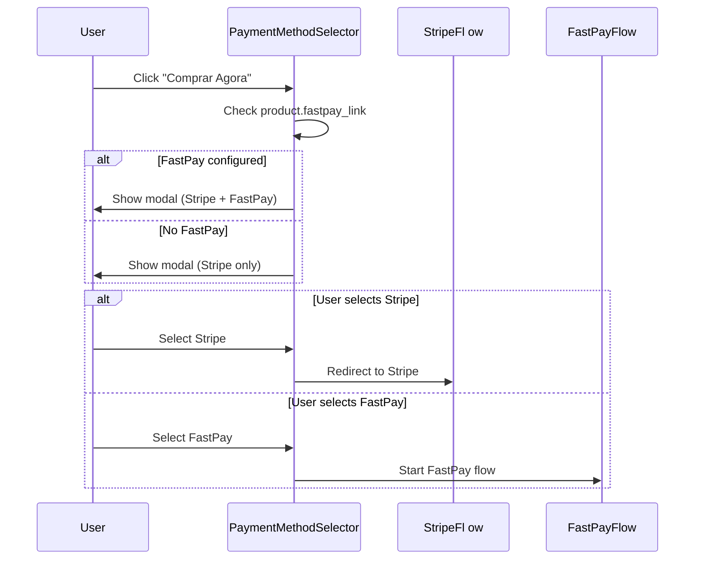
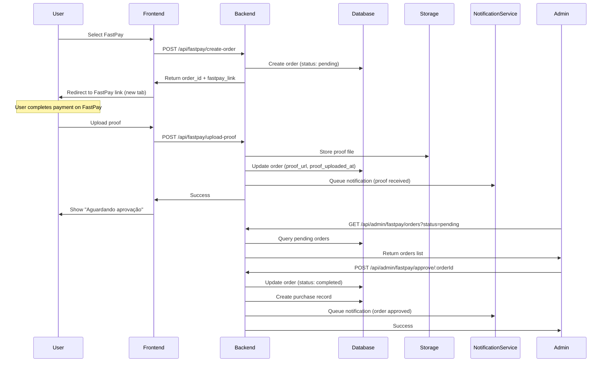

# Design Document: FastPay Payment Method

## Overview

Este documento descreve o design técnico para implementar o método de pagamento FastPay/FaciPay como segunda opção de pagamento na plataforma CodeEngine Learn. O FastPay é um método de pagamento voltado para Angola que funciona através de links de pagamento fixos, upload manual de comprovativo e aprovação manual pelo administrador.

### Objetivos

- Adicionar FastPay como segunda opção de pagamento ao lado do Stripe
- Manter o Stripe como método principal sem modificações
- Implementar fluxo de aprovação manual para pagamentos FastPay
- Garantir que descontos não se apliquem ao FastPay
- Fornecer painel administrativo para gerenciar pedidos FastPay
- Notificar usuários sobre status de seus pedidos

### Escopo

**Incluído:**
- Seletor de método de pagamento (Stripe vs FastPay)
- Fluxo completo de pagamento FastPay
- Upload e armazenamento de comprovantes
- Painel administrativo de aprovação
- Sistema de notificações (in-app e email)
- Dashboard do usuário para acompanhamento de pedidos
- Integração com infraestrutura existente (Supabase, email-service)

**Excluído:**
- Integração automática com API FastPay (não disponível)
- Webhooks FastPay para aprovação automática
- Sistema de reembolsos FastPay
- Relatórios financeiros consolidados (será implementado separadamente)

### Princípios de Design

1. **Não-Intrusivo**: O Stripe existente não deve ser modificado
2. **Consistência**: FastPay deve usar os mesmos mecanismos de acesso que Stripe
3. **Transparência**: Usuários devem entender claramente o processo e tempo de aprovação
4. **Auditabilidade**: Todas as ações administrativas devem ser rastreáveis
5. **Segurança**: Validação rigorosa de uploads e prevenção de fraudes

## Architecture

### High-Level Architecture

```
┌─────────────────────────────────────────────────────────────────┐
│                         Frontend (React)                         │
├─────────────────────────────────────────────────────────────────┤
│                                                                   │
│  ┌──────────────────┐      ┌──────────────────┐                │
│  │ Payment Method   │      │  FastPay Flow    │                │
│  │    Selector      │─────▶│   Components     │                │
│  └──────────────────┘      └──────────────────┘                │
│           │                          │                           │
│           │                          ▼                           │
│           │                 ┌──────────────────┐                │
│           │                 │  Proof Uploader  │                │
│           │                 └──────────────────┘                │
│           │                          │                           │
│           ▼                          ▼                           │
│  ┌──────────────────┐      ┌──────────────────┐                │
│  │ Stripe Checkout  │      │ Order Status     │                │
│  │  (Existing)      │      │    Tracker       │                │
│  └──────────────────┘      └──────────────────┘                │
│                                                                   │
└───────────────────────────┬─────────────────────────────────────┘
                            │
                            │ REST API
                            │
┌───────────────────────────▼─────────────────────────────────────┐
│                    Backend (Node.js + Express)                   │
├─────────────────────────────────────────────────────────────────┤
│                                                                   │
│  ┌──────────────────┐      ┌──────────────────┐                │
│  │  FastPay Order   │      │  Proof Upload    │                │
│  │    Handler       │      │    Handler       │                │
│  └──────────────────┘      └──────────────────┘                │
│           │                          │                           │
│           ▼                          ▼                           │
│  ┌──────────────────┐      ┌──────────────────┐                │
│  │ Order Approval   │      │  Notification    │                │
│  │    Handler       │      │    Service       │                │
│  └──────────────────┘      └──────────────────┘                │
│           │                          │                           │
│           └──────────┬───────────────┘                           │
│                      │                                           │
└──────────────────────┼───────────────────────────────────────────┘
                       │
                       │
┌──────────────────────▼───────────────────────────────────────────┐
│                    Supabase (PostgreSQL + Storage)               │
├─────────────────────────────────────────────────────────────────┤
│                                                                   │
│  ┌──────────────────┐      ┌──────────────────┐                │
│  │ fastpay_orders   │      │ Supabase Storage │                │
│  │     Table        │      │ (fastpay-proofs) │                │
│  └──────────────────┘      └──────────────────┘                │
│           │                          │                           │
│           ▼                          ▼                           │
│  ┌──────────────────┐      ┌──────────────────┐                │
│  │   purchases      │      │  notifications   │                │
│  │     Table        │      │      Table       │                │
│  └──────────────────┘      └──────────────────┘                │
│                                                                   │
└─────────────────────────────────────────────────────────────────┘
```

### Component Interaction Flow

#### Payment Method Selection Flow



#### FastPay Order Creation and Approval Flow



### Technology Stack

**Frontend:**
- React 18 + TypeScript
- Vite (build tool)
- Tailwind CSS (styling)
- React Router (routing)
- i18next (internationalization)

**Backend:**
- Node.js + Express
- TypeScript
- Supabase Client (database + storage)
- Resend API (email)

**Database & Storage:**
- Supabase PostgreSQL (relational data)
- Supabase Storage (file storage)
- Row Level Security (RLS) policies

**External Services:**
- Stripe (existing payment gateway)
- FastPay (external payment links)
- Resend (email delivery)

## Components and Interfaces

### Frontend Components

#### 1. PaymentMethodSelector

**Purpose**: Modal que permite ao usuário escolher entre Stripe e FastPay

**Props:**
```typescript
interface PaymentMethodSelectorProps {
  product: Product;
  onSelectStripe: () => void;
  onSelectFastPay: () => void;
  onClose: () => void;
}
```

**State:**
```typescript
interface PaymentMethodSelectorState {
  isOpen: boolean;
  hasFastPay: boolean;
}
```

**Behavior:**
- Verifica se `product.fastpay_link` está configurado
- Se não configurado, mostra apenas Stripe
- Se configurado, mostra ambas as opções
- Exibe aviso de que descontos não se aplicam ao FastPay
- Responsivo (mobile e desktop)

**Location**: `src/components/payment/PaymentMethodSelector.tsx`

---

#### 2. FastPayFlow

**Purpose**: Componente principal que gerencia o fluxo completo de pagamento FastPay

**Props:**
```typescript
interface FastPayFlowProps {
  product: Product;
  member: Member;
  onComplete: () => void;
  onCancel: () => void;
}
```

**State:**
```typescript
interface FastPayFlowState {
  step: 'instructions' | 'redirecting' | 'upload' | 'waiting';
  orderId: string | null;
  error: string | null;
}
```

**Steps:**
1. **Instructions**: Explica o processo FastPay
2. **Redirecting**: Redireciona para o link FastPay
3. **Upload**: Interface para upload de comprovante
4. **Waiting**: Aguardando aprovação

**Location**: `src/components/payment/FastPayFlow.tsx`

---

#### 3. ProofUploader

**Purpose**: Componente para upload de comprovante de pagamento

**Props:**
```typescript
interface ProofUploaderProps {
  orderId: string;
  onUploadSuccess: () => void;
  onUploadError: (error: string) => void;
}
```

**State:**
```typescript
interface ProofUploaderState {
  file: File | null;
  uploading: boolean;
  progress: number;
  error: string | null;
}
```

**Validation:**
- Formatos aceitos: JPG, PNG, PDF
- Tamanho máximo: 10MB
- Validação de tipo MIME
- Preview de imagem antes do upload

**Location**: `src/components/payment/ProofUploader.tsx`

---

#### 4. OrderStatusTracker

**Purpose**: Componente para acompanhar status de pedidos FastPay

**Props:**
```typescript
interface OrderStatusTrackerProps {
  memberId: string;
}
```

**State:**
```typescript
interface OrderStatusTrackerState {
  orders: FastPayOrder[];
  loading: boolean;
  filter: 'all' | 'pending' | 'completed' | 'failed';
}
```

**Features:**
- Lista todos os pedidos do usuário
- Filtro por status
- Exibe detalhes do pedido
- Mostra comprovante enviado
- Exibe mensagem de rejeição (se aplicável)
- Tempo estimado de aprovação

**Location**: `src/components/member/OrderStatusTracker.tsx`

---

#### 5. AdminApprovalPanel

**Purpose**: Painel administrativo para aprovar/rejeitar pedidos FastPay

**Props:**
```typescript
interface AdminApprovalPanelProps {
  adminId: string;
}
```

**State:**
```typescript
interface AdminApprovalPanelState {
  orders: FastPayOrder[];
  selectedOrder: FastPayOrder | null;
  filter: 'pending' | 'completed' | 'failed' | 'all';
  searchQuery: string;
  loading: boolean;
  rejectionReason: string;
}
```

**Features:**
- Lista de pedidos pendentes
- Filtro por status
- Busca por nome de membro ou produto
- Visualização de comprovante
- Botões de aprovar/rejeitar
- Campo de mensagem para rejeição
- Histórico de ações
- Estatísticas (total pendente, aprovado, rejeitado)

**Location**: `admin/src/components/fastpay/AdminApprovalPanel.tsx`

---

### Backend API Endpoints

#### FastPay Order Management

**1. Create FastPay Order**
```typescript
POST /api/fastpay/create-order

Request:
{
  product_id: string;
  member_id: string;
}

Response:
{
  success: boolean;
  order_id: string;
  fastpay_link: string;
  amount: number;
}

Errors:
- 400: Missing required fields
- 400: Product not found
- 400: FastPay link not configured
- 400: Rate limit exceeded (5 pending orders)
- 401: Unauthorized
- 409: Duplicate order exists
```

**2. Upload Payment Proof**
```typescript
POST /api/fastpay/upload-proof

Content-Type: multipart/form-data

Request:
{
  order_id: string;
  proof_file: File;
}

Response:
{
  success: boolean;
  proof_url: string;
}

Errors:
- 400: Invalid file format
- 400: File too large (>10MB)
- 401: Unauthorized
- 404: Order not found
- 409: Proof already uploaded
```

**3. Get Member Orders**
```typescript
GET /api/fastpay/orders?member_id={id}&status={status}

Response:
{
  success: boolean;
  orders: FastPayOrder[];
}

Errors:
- 401: Unauthorized
- 403: Forbidden (not own orders)
```

**4. Get Order Details**
```typescript
GET /api/fastpay/orders/:orderId

Response:
{
  success: boolean;
  order: FastPayOrder;
}

Errors:
- 401: Unauthorized
- 403: Forbidden
- 404: Order not found
```

---

#### Admin Endpoints

**5. Get All Orders (Admin)**
```typescript
GET /api/admin/fastpay/orders?status={status}&search={query}

Headers:
  x-admin-key: string

Response:
{
  success: boolean;
  orders: FastPayOrder[];
  stats: {
    pending: number;
    completed: number;
    failed: number;
    total: number;
  };
}

Errors:
- 401: Unauthorized
- 403: Forbidden (not admin)
```

**6. Approve Order (Admin)**
```typescript
POST /api/admin/fastpay/approve/:orderId

Headers:
  x-admin-key: string

Request:
{
  admin_id: string;
}

Response:
{
  success: boolean;
  purchase_id: string;
}

Errors:
- 401: Unauthorized
- 403: Forbidden (not admin)
- 404: Order not found
- 409: Order already processed
```

**7. Reject Order (Admin)**
```typescript
POST /api/admin/fastpay/reject/:orderId

Headers:
  x-admin-key: string

Request:
{
  admin_id: string;
  rejection_reason: string;
}

Response:
{
  success: boolean;
}

Errors:
- 401: Unauthorized
- 403: Forbidden (not admin)
- 400: Missing rejection reason
- 404: Order not found
- 409: Order already processed
```

**8. Get Order Statistics (Admin)**
```typescript
GET /api/admin/fastpay/stats

Headers:
  x-admin-key: string

Response:
{
  success: boolean;
  stats: {
    total_orders: number;
    pending_orders: number;
    completed_orders: number;
    failed_orders: number;
    total_revenue: number;
    average_approval_time_hours: number;
  };
}

Errors:
- 401: Unauthorized
- 403: Forbidden (not admin)
```

---

#### Product Configuration

**9. Update Product FastPay Link (Admin)**
```typescript
PUT /api/admin/products/:productId/fastpay-link

Headers:
  x-admin-key: string

Request:
{
  fastpay_link: string | null;
}

Response:
{
  success: boolean;
}

Errors:
- 400: Invalid URL format
- 401: Unauthorized
- 403: Forbidden (not admin)
- 404: Product not found
```

## Data Models

### Database Schema

#### 1. fastpay_orders Table

```sql
CREATE TABLE fastpay_orders (
  id UUID PRIMARY KEY DEFAULT uuid_generate_v4(),
  member_id UUID NOT NULL REFERENCES members(id) ON DELETE CASCADE,
  product_id UUID NOT NULL REFERENCES products(id) ON DELETE RESTRICT,
  amount DECIMAL(10, 2) NOT NULL CHECK (amount >= 0),
  status VARCHAR(20) NOT NULL DEFAULT 'pending' 
    CHECK (status IN ('pending', 'completed', 'failed')),
  
  -- Proof tracking
  proof_url TEXT,
  proof_uploaded_at TIMESTAMPTZ,
  
  -- Approval tracking
  approved_by UUID REFERENCES members(id),
  approved_at TIMESTAMPTZ,
  rejected_by UUID REFERENCES members(id),
  rejected_at TIMESTAMPTZ,
  rejection_reason TEXT,
  
  -- Timestamps
  created_at TIMESTAMPTZ NOT NULL DEFAULT NOW(),
  updated_at TIMESTAMPTZ NOT NULL DEFAULT NOW(),
  
  -- Constraints
  CONSTRAINT unique_pending_order UNIQUE (member_id, product_id, status)
    WHERE status = 'pending'
);

-- Indexes
CREATE INDEX idx_fastpay_orders_member ON fastpay_orders(member_id);
CREATE INDEX idx_fastpay_orders_product ON fastpay_orders(product_id);
CREATE INDEX idx_fastpay_orders_status ON fastpay_orders(status);
CREATE INDEX idx_fastpay_orders_created ON fastpay_orders(created_at DESC);
CREATE INDEX idx_fastpay_orders_pending ON fastpay_orders(status, created_at DESC) 
  WHERE status = 'pending';
```

**Row Level Security (RLS) Policies:**

```sql
-- Enable RLS
ALTER TABLE fastpay_orders ENABLE ROW LEVEL SECURITY;

-- Members can view their own orders
CREATE POLICY "Members can view own orders"
  ON fastpay_orders FOR SELECT
  USING (auth.uid() = (SELECT auth_id FROM members WHERE id = member_id));

-- Members can create their own orders
CREATE POLICY "Members can create own orders"
  ON fastpay_orders FOR INSERT
  WITH CHECK (auth.uid() = (SELECT auth_id FROM members WHERE id = member_id));

-- Members can update their own pending orders (upload proof)
CREATE POLICY "Members can update own pending orders"
  ON fastpay_orders FOR UPDATE
  USING (
    auth.uid() = (SELECT auth_id FROM members WHERE id = member_id)
    AND status = 'pending'
  );

-- Admins can view all orders
CREATE POLICY "Admins can view all orders"
  ON fastpay_orders FOR SELECT
  USING (
    EXISTS (
      SELECT 1 FROM members
      WHERE auth_id = auth.uid()
      AND profile_data->>'role' = 'admin'
    )
  );

-- Admins can update all orders
CREATE POLICY "Admins can update all orders"
  ON fastpay_orders FOR UPDATE
  USING (
    EXISTS (
      SELECT 1 FROM members
      WHERE auth_id = auth.uid()
      AND profile_data->>'role' = 'admin'
    )
  );
```

---

#### 2. products Table (Modification)

```sql
-- Add FastPay link column to existing products table
ALTER TABLE products
ADD COLUMN fastpay_link TEXT;

-- Add constraint to validate URL format
ALTER TABLE products
ADD CONSTRAINT valid_fastpay_link 
  CHECK (
    fastpay_link IS NULL 
    OR fastpay_link ~* '^https?://.+'
  );

-- Add index for products with FastPay enabled
CREATE INDEX idx_products_fastpay ON products(fastpay_link) 
  WHERE fastpay_link IS NOT NULL;
```

---

#### 3. purchases Table (No Modification)

O sistema FastPay reutiliza a tabela `purchases` existente. Quando um pedido FastPay é aprovado, um registro é criado em `purchases` com:

```typescript
{
  member_id: order.member_id,
  product_id: order.product_id,
  amount_paid: order.amount,
  payment_status: 'completed',
  transaction_id: `fastpay_${order.id}`,
  coupon_code: null, // FastPay não usa cupons
  purchase_date: NOW()
}
```

---

### TypeScript Interfaces

#### FastPayOrder

```typescript
interface FastPayOrder {
  id: string;
  member_id: string;
  product_id: string;
  amount: number;
  status: 'pending' | 'completed' | 'failed';
  
  // Proof tracking
  proof_url: string | null;
  proof_uploaded_at: string | null;
  
  // Approval tracking
  approved_by: string | null;
  approved_at: string | null;
  rejected_by: string | null;
  rejected_at: string | null;
  rejection_reason: string | null;
  
  // Timestamps
  created_at: string;
  updated_at: string;
  
  // Joined data (from queries)
  member?: {
    id: string;
    email: string;
    profile_data: {
      name?: string;
    };
  };
  product?: {
    id: string;
    title: string;
    price: number;
    fastpay_link: string;
  };
}
```

#### FastPayOrderCreateRequest

```typescript
interface FastPayOrderCreateRequest {
  product_id: string;
  member_id: string;
}
```

#### FastPayOrderCreateResponse

```typescript
interface FastPayOrderCreateResponse {
  success: boolean;
  order_id: string;
  fastpay_link: string;
  amount: number;
}
```

#### ProofUploadRequest

```typescript
interface ProofUploadRequest {
  order_id: string;
  proof_file: File;
}
```

#### ProofUploadResponse

```typescript
interface ProofUploadResponse {
  success: boolean;
  proof_url: string;
}
```

#### OrderApprovalRequest

```typescript
interface OrderApprovalRequest {
  admin_id: string;
}
```

#### OrderRejectionRequest

```typescript
interface OrderRejectionRequest {
  admin_id: string;
  rejection_reason: string;
}
```

#### FastPayStats

```typescript
interface FastPayStats {
  total_orders: number;
  pending_orders: number;
  completed_orders: number;
  failed_orders: number;
  total_revenue: number;
  average_approval_time_hours: number;
}
```

---

### Supabase Storage Bucket

**Bucket Name**: `fastpay-proofs`

**Configuration:**
```typescript
{
  public: false, // Apenas admins e donos podem acessar
  fileSizeLimit: 10485760, // 10MB
  allowedMimeTypes: [
    'image/jpeg',
    'image/png',
    'application/pdf'
  ]
}
```

**Storage Path Structure:**
```
fastpay-proofs/
  ├── {member_id}/
  │   ├── {order_id}_proof.jpg
  │   ├── {order_id}_proof.png
  │   └── {order_id}_proof.pdf
```

**RLS Policies:**
```sql
-- Members can upload to their own folder
CREATE POLICY "Members can upload own proofs"
  ON storage.objects FOR INSERT
  WITH CHECK (
    bucket_id = 'fastpay-proofs'
    AND auth.uid()::text = (storage.foldername(name))[1]
  );

-- Members can view their own proofs
CREATE POLICY "Members can view own proofs"
  ON storage.objects FOR SELECT
  USING (
    bucket_id = 'fastpay-proofs'
    AND auth.uid()::text = (storage.foldername(name))[1]
  );

-- Admins can view all proofs
CREATE POLICY "Admins can view all proofs"
  ON storage.objects FOR SELECT
  USING (
    bucket_id = 'fastpay-proofs'
    AND EXISTS (
      SELECT 1 FROM members
      WHERE auth_id = auth.uid()
      AND profile_data->>'role' = 'admin'
    )
  );
```


## Correctness Properties

*A property is a characteristic or behavior that should hold true across all valid executions of a system—essentially, a formal statement about what the system should do. Properties serve as the bridge between human-readable specifications and machine-verifiable correctness guarantees.*

**Property Reflection:**

After analyzing all acceptance criteria, the following properties were identified as testable through property-based testing. Redundant properties have been consolidated:

**Consolidated Properties:**
- Properties 6.2, 6.3 are covered by 5.6 and 5.7 (order status transitions)
- Properties 6.7 and 6.8 are combined into Property 8 (audit trail)
- Properties 7.1 and 7.2 are covered by 6.4 and 6.5 (access granting)
- Property 12.1 and 12.3 are covered by 3.5 (file validation)
- Property 12.6 is covered by Property 8 (audit logging)

### Property 1: URL Validation

*For any* string input to the FastPay link field, the validation function SHALL correctly identify valid URLs (starting with http:// or https://) and reject invalid formats.

**Validates: Requirements 2.3**

### Property 2: Order Creation with Pending Status

*For any* valid member and product combination, when a FastPay order is created, the system SHALL set the initial status to "pending".

**Validates: Requirements 3.1, 6.1**

### Property 3: File Format and Size Validation

*For any* uploaded file, the system SHALL accept files that are JPG, PNG, or PDF format and under 10MB, and SHALL reject files that do not meet these criteria.

**Validates: Requirements 3.5, 12.1, 12.3**

### Property 4: Proof Upload Timestamp

*For any* order, when a payment proof is uploaded, the system SHALL record a proof_uploaded_at timestamp.

**Validates: Requirements 3.7**

### Property 5: Discount Exclusion for FastPay

*For any* product with any discount configuration, when a FastPay order is created, the system SHALL use the original product price without applying any discounts.

**Validates: Requirements 4.1, 4.5**

### Property 6: Order Approval Status Transition

*For any* pending order, when an administrator approves it, the system SHALL update the order status to "completed".

**Validates: Requirements 5.6, 6.2**

### Property 7: Order Rejection Status Transition

*For any* pending order, when an administrator rejects it, the system SHALL update the order status to "failed".

**Validates: Requirements 5.7, 6.3**

### Property 8: Audit Trail Completeness

*For any* order status change (approval or rejection), the system SHALL record both the administrator ID who performed the action and the timestamp of the action.

**Validates: Requirements 6.7, 6.8, 12.6**

### Property 9: Product Access Granting on Approval

*For any* completed order, the member SHALL have access to the associated product.

**Validates: Requirements 6.4, 7.2**

### Property 10: Purchase Record Creation on Approval

*For any* completed order, the system SHALL create a corresponding purchase record in the purchases table.

**Validates: Requirements 6.5, 7.1**

### Property 11: No Access on Failed Orders

*For any* failed order, the member SHALL NOT have access to the associated product.

**Validates: Requirements 6.6**

### Property 12: Notification Read Status Update

*For any* notification, when a member views it, the system SHALL update the read_status to true.

**Validates: Requirements 8.8**

### Property 13: Order Filtering by Status

*For any* set of orders and any status filter (pending, completed, failed), the filtered results SHALL contain only orders matching the selected status.

**Validates: Requirements 5.10**

### Property 14: Order Search by Name

*For any* search query and set of orders, the search results SHALL contain only orders where the member name or product name contains the search query.

**Validates: Requirements 5.11**

### Property 15: Duplicate Order Prevention

*For any* member and product combination, the system SHALL prevent creation of a second pending order if one already exists.

**Validates: Requirements 12.4**

### Property 16: Rate Limiting Enforcement

*For any* member, the system SHALL prevent creation of more than 5 pending orders at any given time.

**Validates: Requirements 12.7**

## Error Handling

### Error Categories

#### 1. Validation Errors (400 Bad Request)

**Scenarios:**
- Missing required fields (product_id, member_id)
- Invalid file format (not JPG, PNG, or PDF)
- File size exceeds 10MB
- Invalid URL format for FastPay link
- Missing rejection reason when rejecting order
- FastPay link not configured for product

**Handling:**
- Return clear error message to user
- Log validation failure
- Do not create/update database records
- Provide actionable feedback

**Example Response:**
```json
{
  "success": false,
  "error": "Invalid file format. Only JPG, PNG, and PDF are accepted.",
  "code": "INVALID_FILE_FORMAT"
}
```

---

#### 2. Authentication Errors (401 Unauthorized)

**Scenarios:**
- No authentication token provided
- Invalid or expired token
- Token does not match a valid user

**Handling:**
- Return 401 status code
- Redirect to login page (frontend)
- Clear invalid tokens from storage
- Log authentication failure

**Example Response:**
```json
{
  "success": false,
  "error": "Authentication required",
  "code": "UNAUTHORIZED"
}
```

---

#### 3. Authorization Errors (403 Forbidden)

**Scenarios:**
- Non-admin trying to access admin endpoints
- Member trying to access another member's orders
- Member trying to approve/reject orders

**Handling:**
- Return 403 status code
- Log authorization failure with user ID
- Do not reveal existence of protected resources
- Provide generic error message

**Example Response:**
```json
{
  "success": false,
  "error": "You do not have permission to perform this action",
  "code": "FORBIDDEN"
}
```

---

#### 4. Not Found Errors (404 Not Found)

**Scenarios:**
- Order ID does not exist
- Product ID does not exist
- Member ID does not exist
- Proof file not found in storage

**Handling:**
- Return 404 status code
- Log the missing resource
- Provide specific error message
- Suggest alternative actions

**Example Response:**
```json
{
  "success": false,
  "error": "Order not found",
  "code": "ORDER_NOT_FOUND"
}
```

---

#### 5. Conflict Errors (409 Conflict)

**Scenarios:**
- Duplicate pending order for same member/product
- Order already processed (trying to approve/reject twice)
- Proof already uploaded for order
- Rate limit exceeded (5 pending orders)

**Handling:**
- Return 409 status code
- Explain the conflict clearly
- Provide current state information
- Suggest resolution

**Example Response:**
```json
{
  "success": false,
  "error": "You already have a pending order for this product",
  "code": "DUPLICATE_ORDER",
  "existing_order_id": "uuid-here"
}
```

---

#### 6. Storage Errors (500 Internal Server Error)

**Scenarios:**
- Supabase storage unavailable
- File upload fails
- Storage quota exceeded
- Network timeout during upload

**Handling:**
- Return 500 status code
- Log full error details
- Queue retry for transient failures
- Notify user to try again
- Alert administrators for persistent failures

**Example Response:**
```json
{
  "success": false,
  "error": "Failed to upload proof. Please try again.",
  "code": "STORAGE_ERROR",
  "retry": true
}
```

---

#### 7. Database Errors (500 Internal Server Error)

**Scenarios:**
- Database connection failure
- Query timeout
- Constraint violation
- Transaction rollback

**Handling:**
- Return 500 status code
- Log full error with stack trace
- Rollback any partial transactions
- Notify administrators
- Provide generic error to user (don't expose DB details)

**Example Response:**
```json
{
  "success": false,
  "error": "An error occurred while processing your request. Please try again.",
  "code": "DATABASE_ERROR"
}
```

---

### Error Recovery Strategies

#### Transient Failures

**Strategy**: Automatic retry with exponential backoff

**Applies to:**
- Network timeouts
- Temporary storage unavailability
- Database connection issues

**Implementation:**
```typescript
async function retryWithBackoff<T>(
  fn: () => Promise<T>,
  maxRetries: number = 3,
  baseDelay: number = 1000
): Promise<T> {
  for (let i = 0; i < maxRetries; i++) {
    try {
      return await fn();
    } catch (error) {
      if (i === maxRetries - 1) throw error;
      const delay = baseDelay * Math.pow(2, i);
      await new Promise(resolve => setTimeout(resolve, delay));
    }
  }
  throw new Error('Max retries exceeded');
}
```

---

#### Partial Failures

**Strategy**: Compensating transactions

**Scenario**: Order created but notification failed

**Implementation:**
1. Complete primary operation (create order)
2. Queue secondary operation (send notification)
3. Process queue asynchronously
4. Retry failed notifications
5. Log failures for manual review

---

#### User-Initiated Recovery

**Strategy**: Provide clear recovery actions

**Examples:**
- "Upload failed. Click here to try again."
- "Order not found. Return to products page."
- "Session expired. Please log in again."

---

### Error Monitoring

**Logging Strategy:**
```typescript
interface ErrorLog {
  timestamp: string;
  error_code: string;
  error_message: string;
  user_id: string | null;
  endpoint: string;
  request_body: any;
  stack_trace: string;
  severity: 'low' | 'medium' | 'high' | 'critical';
}
```

**Alert Thresholds:**
- **Critical**: Database unavailable, storage full
- **High**: >10 errors/minute on same endpoint
- **Medium**: >5 failed uploads/hour
- **Low**: Individual validation failures

## Testing Strategy

### Testing Approach

O sistema FastPay utiliza uma abordagem de testes em múltiplas camadas:

1. **Unit Tests**: Componentes individuais e funções puras
2. **Property-Based Tests**: Propriedades universais (ver seção Correctness Properties)
3. **Integration Tests**: Interações com Supabase, Storage, e Email Service
4. **End-to-End Tests**: Fluxos completos de usuário

### Unit Testing

**Framework**: Jest + React Testing Library

**Coverage Target**: >80% para lógica de negócio

**Test Categories:**

#### Frontend Components

```typescript
// PaymentMethodSelector.test.tsx
describe('PaymentMethodSelector', () => {
  it('shows only Stripe when FastPay link not configured', () => {
    const product = { ...mockProduct, fastpay_link: null };
    render(<PaymentMethodSelector product={product} />);
    expect(screen.getByText('Stripe (Internacional)')).toBeInTheDocument();
    expect(screen.queryByText('FastPay (Angola)')).not.toBeInTheDocument();
  });

  it('shows both options when FastPay link configured', () => {
    const product = { ...mockProduct, fastpay_link: 'https://fastpay.ao/pay/123' };
    render(<PaymentMethodSelector product={product} />);
    expect(screen.getByText('Stripe (Internacional)')).toBeInTheDocument();
    expect(screen.getByText('FastPay (Angola)')).toBeInTheDocument();
  });

  it('displays discount warning for FastPay', () => {
    const product = { ...mockProduct, fastpay_link: 'https://fastpay.ao/pay/123' };
    render(<PaymentMethodSelector product={product} />);
    expect(screen.getByText(/descontos.*apenas.*Stripe/i)).toBeInTheDocument();
  });
});
```

#### Backend Validation

```typescript
// validation.test.ts
describe('FastPay Validation', () => {
  describe('validateFastPayLink', () => {
    it('accepts valid HTTPS URLs', () => {
      expect(validateFastPayLink('https://fastpay.ao/pay/123')).toBe(true);
    });

    it('accepts valid HTTP URLs', () => {
      expect(validateFastPayLink('http://fastpay.ao/pay/123')).toBe(true);
    });

    it('rejects invalid URLs', () => {
      expect(validateFastPayLink('not-a-url')).toBe(false);
      expect(validateFastPayLink('ftp://fastpay.ao')).toBe(false);
      expect(validateFastPayLink('')).toBe(false);
    });
  });

  describe('validateProofFile', () => {
    it('accepts valid image formats', () => {
      const jpgFile = new File([''], 'proof.jpg', { type: 'image/jpeg' });
      const pngFile = new File([''], 'proof.png', { type: 'image/png' });
      expect(validateProofFile(jpgFile)).toBe(true);
      expect(validateProofFile(pngFile)).toBe(true);
    });

    it('accepts PDF format', () => {
      const pdfFile = new File([''], 'proof.pdf', { type: 'application/pdf' });
      expect(validateProofFile(pdfFile)).toBe(true);
    });

    it('rejects invalid formats', () => {
      const txtFile = new File([''], 'proof.txt', { type: 'text/plain' });
      expect(validateProofFile(txtFile)).toBe(false);
    });

    it('rejects files over 10MB', () => {
      const largeFile = new File([new ArrayBuffer(11 * 1024 * 1024)], 'large.jpg');
      expect(validateProofFile(largeFile)).toBe(false);
    });
  });
});
```

### Property-Based Testing

**Framework**: fast-check (JavaScript/TypeScript)

**Configuration**: Minimum 100 iterations per property

**Test Implementation:**

```typescript
// fastpay-properties.test.ts
import fc from 'fast-check';

/**
 * Feature: fastpay-payment-method, Property 1: URL Validation
 * For any string input, validation correctly identifies valid URLs
 */
describe('Property 1: URL Validation', () => {
  it('correctly validates URL format', () => {
    fc.assert(
      fc.property(
        fc.webUrl({ validSchemes: ['http', 'https'] }),
        (validUrl) => {
          expect(validateFastPayLink(validUrl)).toBe(true);
        }
      ),
      { numRuns: 100 }
    );

    fc.assert(
      fc.property(
        fc.string().filter(s => !s.match(/^https?:\/\/.+/)),
        (invalidUrl) => {
          expect(validateFastPayLink(invalidUrl)).toBe(false);
        }
      ),
      { numRuns: 100 }
    );
  });
});

/**
 * Feature: fastpay-payment-method, Property 2: Order Creation with Pending Status
 * For any valid member/product, new orders start with pending status
 */
describe('Property 2: Order Creation with Pending Status', () => {
  it('creates orders with pending status', () => {
    fc.assert(
      fc.asyncProperty(
        fc.uuid(),
        fc.uuid(),
        async (memberId, productId) => {
          const order = await createFastPayOrder({ member_id: memberId, product_id: productId });
          expect(order.status).toBe('pending');
        }
      ),
      { numRuns: 100 }
    );
  });
});

/**
 * Feature: fastpay-payment-method, Property 3: File Format and Size Validation
 * For any file, validation accepts valid formats/sizes and rejects invalid ones
 */
describe('Property 3: File Format and Size Validation', () => {
  it('validates file format and size correctly', () => {
    const validFormats = ['image/jpeg', 'image/png', 'application/pdf'];
    const invalidFormats = ['text/plain', 'application/zip', 'video/mp4'];

    fc.assert(
      fc.property(
        fc.constantFrom(...validFormats),
        fc.integer({ min: 1, max: 10 * 1024 * 1024 }),
        (mimeType, size) => {
          const file = new File([new ArrayBuffer(size)], 'test', { type: mimeType });
          expect(validateProofFile(file)).toBe(true);
        }
      ),
      { numRuns: 100 }
    );

    fc.assert(
      fc.property(
        fc.constantFrom(...invalidFormats),
        fc.integer({ min: 1, max: 10 * 1024 * 1024 }),
        (mimeType, size) => {
          const file = new File([new ArrayBuffer(size)], 'test', { type: mimeType });
          expect(validateProofFile(file)).toBe(false);
        }
      ),
      { numRuns: 100 }
    );

    fc.assert(
      fc.property(
        fc.constantFrom(...validFormats),
        fc.integer({ min: 10 * 1024 * 1024 + 1, max: 50 * 1024 * 1024 }),
        (mimeType, size) => {
          const file = new File([new ArrayBuffer(size)], 'test', { type: mimeType });
          expect(validateProofFile(file)).toBe(false);
        }
      ),
      { numRuns: 100 }
    );
  });
});

/**
 * Feature: fastpay-payment-method, Property 5: Discount Exclusion for FastPay
 * For any product with discounts, FastPay uses original price
 */
describe('Property 5: Discount Exclusion for FastPay', () => {
  it('uses original price regardless of discounts', () => {
    fc.assert(
      fc.asyncProperty(
        fc.record({
          id: fc.uuid(),
          price: fc.float({ min: 1, max: 10000, noNaN: true }),
          discount_percentage: fc.integer({ min: 0, max: 100 })
        }),
        async (product) => {
          const order = await createFastPayOrder({
            member_id: 'test-member',
            product_id: product.id
          });
          expect(order.amount).toBe(product.price);
        }
      ),
      { numRuns: 100 }
    );
  });
});

/**
 * Feature: fastpay-payment-method, Property 15: Duplicate Order Prevention
 * For any member/product pair, only one pending order can exist
 */
describe('Property 15: Duplicate Order Prevention', () => {
  it('prevents duplicate pending orders', () => {
    fc.assert(
      fc.asyncProperty(
        fc.uuid(),
        fc.uuid(),
        async (memberId, productId) => {
          await createFastPayOrder({ member_id: memberId, product_id: productId });
          await expect(
            createFastPayOrder({ member_id: memberId, product_id: productId })
          ).rejects.toThrow('DUPLICATE_ORDER');
        }
      ),
      { numRuns: 100 }
    );
  });
});

/**
 * Feature: fastpay-payment-method, Property 16: Rate Limiting Enforcement
 * For any member, max 5 pending orders allowed
 */
describe('Property 16: Rate Limiting Enforcement', () => {
  it('enforces 5 pending orders limit', () => {
    fc.assert(
      fc.asyncProperty(
        fc.uuid(),
        fc.array(fc.uuid(), { minLength: 6, maxLength: 6 }),
        async (memberId, productIds) => {
          // Create 5 orders successfully
          for (let i = 0; i < 5; i++) {
            await createFastPayOrder({ member_id: memberId, product_id: productIds[i] });
          }
          
          // 6th order should fail
          await expect(
            createFastPayOrder({ member_id: memberId, product_id: productIds[5] })
          ).rejects.toThrow('RATE_LIMIT_EXCEEDED');
        }
      ),
      { numRuns: 100 }
    );
  });
});
```

### Integration Testing

**Framework**: Jest + Supertest

**Test Categories:**

#### API Endpoints

```typescript
// fastpay-api.integration.test.ts
describe('FastPay API Integration', () => {
  let authToken: string;
  let memberId: string;
  let productId: string;

  beforeAll(async () => {
    // Setup test user and product
    const { token, member } = await createTestUser();
    authToken = token;
    memberId = member.id;
    productId = await createTestProduct({ fastpay_link: 'https://test.com/pay' });
  });

  describe('POST /api/fastpay/create-order', () => {
    it('creates order successfully', async () => {
      const response = await request(app)
        .post('/api/fastpay/create-order')
        .set('Authorization', `Bearer ${authToken}`)
        .send({ product_id: productId, member_id: memberId });

      expect(response.status).toBe(200);
      expect(response.body.success).toBe(true);
      expect(response.body.order_id).toBeDefined();
      expect(response.body.fastpay_link).toBe('https://test.com/pay');
    });

    it('returns 409 for duplicate order', async () => {
      await request(app)
        .post('/api/fastpay/create-order')
        .set('Authorization', `Bearer ${authToken}`)
        .send({ product_id: productId, member_id: memberId });

      const response = await request(app)
        .post('/api/fastpay/create-order')
        .set('Authorization', `Bearer ${authToken}`)
        .send({ product_id: productId, member_id: memberId });

      expect(response.status).toBe(409);
      expect(response.body.code).toBe('DUPLICATE_ORDER');
    });
  });

  describe('POST /api/fastpay/upload-proof', () => {
    it('uploads proof successfully', async () => {
      const order = await createTestOrder(memberId, productId);
      const proofFile = Buffer.from('fake-image-data');

      const response = await request(app)
        .post('/api/fastpay/upload-proof')
        .set('Authorization', `Bearer ${authToken}`)
        .field('order_id', order.id)
        .attach('proof_file', proofFile, 'proof.jpg');

      expect(response.status).toBe(200);
      expect(response.body.success).toBe(true);
      expect(response.body.proof_url).toContain('fastpay-proofs');
    });
  });
});
```

#### Database Operations

```typescript
// database.integration.test.ts
describe('Database Integration', () => {
  it('enforces unique pending order constraint', async () => {
    const memberId = 'test-member';
    const productId = 'test-product';

    await supabase.from('fastpay_orders').insert({
      member_id: memberId,
      product_id: productId,
      amount: 100,
      status: 'pending'
    });

    const { error } = await supabase.from('fastpay_orders').insert({
      member_id: memberId,
      product_id: productId,
      amount: 100,
      status: 'pending'
    });

    expect(error).toBeDefined();
    expect(error?.code).toBe('23505'); // Unique violation
  });

  it('creates purchase record on order approval', async () => {
    const order = await createTestOrder('member-1', 'product-1');

    await supabase
      .from('fastpay_orders')
      .update({ status: 'completed', approved_at: new Date().toISOString() })
      .eq('id', order.id);

    const { data: purchase } = await supabase
      .from('purchases')
      .select('*')
      .eq('transaction_id', `fastpay_${order.id}`)
      .single();

    expect(purchase).toBeDefined();
    expect(purchase.member_id).toBe('member-1');
    expect(purchase.product_id).toBe('product-1');
  });
});
```

#### Storage Operations

```typescript
// storage.integration.test.ts
describe('Storage Integration', () => {
  it('uploads proof to correct path', async () => {
    const memberId = 'test-member';
    const orderId = 'test-order';
    const file = Buffer.from('test-image');

    const { data, error } = await supabase.storage
      .from('fastpay-proofs')
      .upload(`${memberId}/${orderId}_proof.jpg`, file);

    expect(error).toBeNull();
    expect(data?.path).toBe(`${memberId}/${orderId}_proof.jpg`);
  });

  it('enforces RLS policies', async () => {
    const member1Token = await getTestUserToken('member-1');
    const member2Token = await getTestUserToken('member-2');

    // Member 1 uploads proof
    await supabase.storage
      .from('fastpay-proofs')
      .upload('member-1/order-1_proof.jpg', Buffer.from('test'));

    // Member 2 cannot access Member 1's proof
    const { data, error } = await supabase.storage
      .from('fastpay-proofs')
      .download('member-1/order-1_proof.jpg');

    expect(error).toBeDefined();
    expect(error?.message).toContain('permission');
  });
});
```

### End-to-End Testing

**Framework**: Playwright

**Test Scenarios:**

```typescript
// fastpay-e2e.spec.ts
import { test, expect } from '@playwright/test';

test.describe('FastPay Complete Flow', () => {
  test('user can complete FastPay purchase', async ({ page }) => {
    // Login
    await page.goto('/login');
    await page.fill('[name="email"]', 'test@example.com');
    await page.fill('[name="password"]', 'password123');
    await page.click('button[type="submit"]');

    // Navigate to product
    await page.goto('/products/test-product-id');
    await page.click('button:has-text("Comprar Agora")');

    // Select FastPay
    await expect(page.locator('text=Escolha o método de pagamento')).toBeVisible();
    await page.click('button:has-text("FastPay (Angola)")');

    // Verify instructions
    await expect(page.locator('text=Siga os passos abaixo')).toBeVisible();
    await page.click('button:has-text("Continuar para FastPay")');

    // Upload proof
    await page.setInputFiles('input[type="file"]', 'test-proof.jpg');
    await page.click('button:has-text("Enviar Comprovativo")');

    // Verify success message
    await expect(page.locator('text=Comprovativo enviado com sucesso')).toBeVisible();
    await expect(page.locator('text=Aprovação em até 24 horas')).toBeVisible();
  });

  test('admin can approve order', async ({ page }) => {
    // Login as admin
    await page.goto('/admin/login');
    await page.fill('[name="email"]', 'admin@example.com');
    await page.fill('[name="password"]', 'admin123');
    await page.click('button[type="submit"]');

    // Navigate to FastPay panel
    await page.goto('/admin/fastpay');

    // View pending orders
    await expect(page.locator('text=Pedidos Pendentes')).toBeVisible();
    await page.click('tr:first-child button:has-text("Ver Detalhes")');

    // Approve order
    await expect(page.locator('img[alt="Comprovante"]')).toBeVisible();
    await page.click('button:has-text("Aprovar")');

    // Verify success
    await expect(page.locator('text=Pedido aprovado com sucesso')).toBeVisible();
  });
});
```

### Test Data Management

**Strategy**: Use factories and fixtures

```typescript
// test-factories.ts
export const createTestProduct = async (overrides = {}) => {
  const product = {
    title: 'Test Product',
    description: 'Test Description',
    price: 100,
    fastpay_link: 'https://test.com/pay',
    ...overrides
  };

  const { data } = await supabase
    .from('products')
    .insert(product)
    .select()
    .single();

  return data;
};

export const createTestOrder = async (memberId: string, productId: string, overrides = {}) => {
  const order = {
    member_id: memberId,
    product_id: productId,
    amount: 100,
    status: 'pending',
    ...overrides
  };

  const { data } = await supabase
    .from('fastpay_orders')
    .insert(order)
    .select()
    .single();

  return data;
};
```

### Continuous Integration

**CI Pipeline** (GitHub Actions):

```yaml
name: FastPay Tests

on: [push, pull_request]

jobs:
  test:
    runs-on: ubuntu-latest
    
    steps:
      - uses: actions/checkout@v3
      
      - name: Setup Node.js
        uses: actions/setup-node@v3
        with:
          node-version: '18'
      
      - name: Install dependencies
        run: npm ci
      
      - name: Run unit tests
        run: npm run test:unit
      
      - name: Run property-based tests
        run: npm run test:properties
      
      - name: Run integration tests
        run: npm run test:integration
        env:
          SUPABASE_URL: ${{ secrets.TEST_SUPABASE_URL }}
          SUPABASE_KEY: ${{ secrets.TEST_SUPABASE_KEY }}
      
      - name: Run E2E tests
        run: npm run test:e2e
      
      - name: Upload coverage
        uses: codecov/codecov-action@v3
```

### Test Coverage Goals

- **Unit Tests**: >80% coverage
- **Property-Based Tests**: All 16 properties implemented
- **Integration Tests**: All API endpoints covered
- **E2E Tests**: Critical user flows covered


## Security Considerations

### Authentication and Authorization

#### User Authentication

**Mechanism**: Supabase Auth (JWT tokens)

**Implementation:**
```typescript
// Middleware to verify authentication
async function requireAuth(req: Request, res: Response, next: NextFunction) {
  const authHeader = req.headers.authorization;
  
  if (!authHeader || !authHeader.startsWith('Bearer ')) {
    return res.status(401).json({ error: 'Unauthorized', code: 'NO_AUTH_TOKEN' });
  }

  const token = authHeader.replace('Bearer ', '');
  
  try {
    const { data: { user }, error } = await supabaseAdmin.auth.getUser(token);
    
    if (error || !user) {
      return res.status(401).json({ error: 'Invalid token', code: 'INVALID_TOKEN' });
    }

    req.user = user;
    next();
  } catch (error) {
    return res.status(401).json({ error: 'Authentication failed', code: 'AUTH_FAILED' });
  }
}
```

#### Admin Authorization

**Mechanism**: Role-based access control via member profile

**Implementation:**
```typescript
// Middleware to verify admin role
async function requireAdmin(req: Request, res: Response, next: NextFunction) {
  const adminKey = req.headers['x-admin-key'];
  
  if (adminKey !== process.env.ADMIN_API_KEY) {
    return res.status(403).json({ error: 'Forbidden', code: 'NOT_ADMIN' });
  }

  // Verify user is actually an admin in database
  const { data: member } = await supabaseAdmin
    .from('members')
    .select('profile_data')
    .eq('auth_id', req.user.id)
    .single();

  if (member?.profile_data?.role !== 'admin') {
    return res.status(403).json({ error: 'Forbidden', code: 'NOT_ADMIN' });
  }

  next();
}
```

### Data Validation

#### Input Sanitization

**All user inputs must be sanitized:**

```typescript
import validator from 'validator';
import DOMPurify from 'isomorphic-dompurify';

// Sanitize text inputs
function sanitizeText(input: string): string {
  return DOMPurify.sanitize(input, { ALLOWED_TAGS: [] });
}

// Validate and sanitize URLs
function sanitizeUrl(url: string): string | null {
  if (!validator.isURL(url, { protocols: ['http', 'https'] })) {
    return null;
  }
  return validator.escape(url);
}

// Validate UUIDs
function isValidUUID(id: string): boolean {
  return validator.isUUID(id, 4);
}
```

#### File Upload Validation

**Multi-layer validation:**

```typescript
async function validateUploadedFile(file: Express.Multer.File): Promise<ValidationResult> {
  // 1. Check file size
  if (file.size > 10 * 1024 * 1024) {
    return { valid: false, error: 'File too large (max 10MB)' };
  }

  // 2. Check MIME type
  const allowedTypes = ['image/jpeg', 'image/png', 'application/pdf'];
  if (!allowedTypes.includes(file.mimetype)) {
    return { valid: false, error: 'Invalid file type' };
  }

  // 3. Verify file signature (magic bytes)
  const fileSignature = await getFileSignature(file.buffer);
  if (!isValidSignature(fileSignature, file.mimetype)) {
    return { valid: false, error: 'File signature mismatch' };
  }

  // 4. Scan for malware (if service available)
  if (process.env.MALWARE_SCAN_ENABLED === 'true') {
    const scanResult = await scanForMalware(file.buffer);
    if (!scanResult.clean) {
      return { valid: false, error: 'Malware detected' };
    }
  }

  return { valid: true };
}

// Check file signature (magic bytes)
function getFileSignature(buffer: Buffer): string {
  return buffer.slice(0, 4).toString('hex');
}

function isValidSignature(signature: string, mimeType: string): boolean {
  const signatures: Record<string, string[]> = {
    'image/jpeg': ['ffd8ffe0', 'ffd8ffe1', 'ffd8ffe2'],
    'image/png': ['89504e47'],
    'application/pdf': ['25504446']
  };

  return signatures[mimeType]?.some(sig => signature.startsWith(sig)) || false;
}
```

### SQL Injection Prevention

**Use parameterized queries:**

```typescript
// ❌ NEVER do this
const query = `SELECT * FROM fastpay_orders WHERE member_id = '${memberId}'`;

// ✅ Always use parameterized queries
const { data } = await supabase
  .from('fastpay_orders')
  .select('*')
  .eq('member_id', memberId);
```

### Cross-Site Scripting (XSS) Prevention

**Sanitize all user-generated content:**

```typescript
// Frontend: Sanitize before rendering
import DOMPurify from 'dompurify';

function OrderDetails({ order }: { order: FastPayOrder }) {
  const sanitizedReason = DOMPurify.sanitize(order.rejection_reason || '');
  
  return (
    <div dangerouslySetInnerHTML={{ __html: sanitizedReason }} />
  );
}

// Backend: Sanitize before storing
function sanitizeOrderData(data: any) {
  return {
    ...data,
    rejection_reason: DOMPurify.sanitize(data.rejection_reason || '')
  };
}
```

### Cross-Site Request Forgery (CSRF) Protection

**CSRF tokens for state-changing operations:**

```typescript
// Generate CSRF token
function generateCSRFToken(): string {
  return crypto.randomBytes(32).toString('hex');
}

// Verify CSRF token
function verifyCSRFToken(req: Request): boolean {
  const token = req.headers['x-csrf-token'];
  const sessionToken = req.session.csrfToken;
  
  return token === sessionToken;
}

// Middleware
function requireCSRF(req: Request, res: Response, next: NextFunction) {
  if (!verifyCSRFToken(req)) {
    return res.status(403).json({ error: 'Invalid CSRF token' });
  }
  next();
}
```

### Rate Limiting

**Prevent abuse through rate limiting:**

```typescript
import rateLimit from 'express-rate-limit';

// Global rate limit
const globalLimiter = rateLimit({
  windowMs: 15 * 60 * 1000, // 15 minutes
  max: 100, // 100 requests per window
  message: 'Too many requests, please try again later'
});

// Order creation rate limit
const orderCreationLimiter = rateLimit({
  windowMs: 60 * 60 * 1000, // 1 hour
  max: 10, // 10 orders per hour
  keyGenerator: (req) => req.user.id,
  message: 'Too many orders created, please try again later'
});

// Proof upload rate limit
const uploadLimiter = rateLimit({
  windowMs: 60 * 60 * 1000, // 1 hour
  max: 20, // 20 uploads per hour
  keyGenerator: (req) => req.user.id,
  message: 'Too many uploads, please try again later'
});

app.use('/api', globalLimiter);
app.post('/api/fastpay/create-order', orderCreationLimiter, createOrder);
app.post('/api/fastpay/upload-proof', uploadLimiter, uploadProof);
```

### Secure File Storage

**Supabase Storage security:**

```typescript
// Generate secure file path
function generateSecureFilePath(memberId: string, orderId: string, filename: string): string {
  const ext = path.extname(filename);
  const timestamp = Date.now();
  const random = crypto.randomBytes(8).toString('hex');
  
  return `${memberId}/${orderId}_${timestamp}_${random}${ext}`;
}

// Upload with security checks
async function uploadProofSecurely(
  memberId: string,
  orderId: string,
  file: Express.Multer.File
): Promise<string> {
  // Validate file
  const validation = await validateUploadedFile(file);
  if (!validation.valid) {
    throw new Error(validation.error);
  }

  // Generate secure path
  const filePath = generateSecureFilePath(memberId, orderId, file.originalname);

  // Upload to Supabase Storage
  const { data, error } = await supabaseAdmin.storage
    .from('fastpay-proofs')
    .upload(filePath, file.buffer, {
      contentType: file.mimetype,
      cacheControl: '3600',
      upsert: false
    });

  if (error) {
    throw new Error(`Upload failed: ${error.message}`);
  }

  return data.path;
}
```

### Audit Logging

**Log all sensitive operations:**

```typescript
interface AuditLog {
  timestamp: string;
  user_id: string;
  action: string;
  resource_type: string;
  resource_id: string;
  details: any;
  ip_address: string;
  user_agent: string;
}

async function logAuditEvent(event: AuditLog): Promise<void> {
  await supabaseAdmin.from('audit_logs').insert({
    ...event,
    timestamp: new Date().toISOString()
  });
}

// Usage
await logAuditEvent({
  user_id: adminId,
  action: 'APPROVE_ORDER',
  resource_type: 'fastpay_order',
  resource_id: orderId,
  details: { amount: order.amount, product_id: order.product_id },
  ip_address: req.ip,
  user_agent: req.headers['user-agent']
});
```

### Sensitive Data Protection

**Encrypt sensitive data at rest:**

```typescript
import crypto from 'crypto';

const ENCRYPTION_KEY = process.env.ENCRYPTION_KEY; // 32 bytes
const IV_LENGTH = 16;

function encrypt(text: string): string {
  const iv = crypto.randomBytes(IV_LENGTH);
  const cipher = crypto.createCipheriv('aes-256-cbc', Buffer.from(ENCRYPTION_KEY), iv);
  let encrypted = cipher.update(text);
  encrypted = Buffer.concat([encrypted, cipher.final()]);
  return iv.toString('hex') + ':' + encrypted.toString('hex');
}

function decrypt(text: string): string {
  const parts = text.split(':');
  const iv = Buffer.from(parts.shift()!, 'hex');
  const encryptedText = Buffer.from(parts.join(':'), 'hex');
  const decipher = crypto.createDecipheriv('aes-256-cbc', Buffer.from(ENCRYPTION_KEY), iv);
  let decrypted = decipher.update(encryptedText);
  decrypted = Buffer.concat([decrypted, decipher.final()]);
  return decrypted.toString();
}

// Note: For FastPay, most data is not sensitive enough to require encryption
// But this is available if needed for future enhancements
```

### Security Headers

**Set secure HTTP headers:**

```typescript
import helmet from 'helmet';

app.use(helmet({
  contentSecurityPolicy: {
    directives: {
      defaultSrc: ["'self'"],
      styleSrc: ["'self'", "'unsafe-inline'"],
      scriptSrc: ["'self'"],
      imgSrc: ["'self'", 'data:', 'https:'],
      connectSrc: ["'self'", process.env.SUPABASE_URL],
      fontSrc: ["'self'"],
      objectSrc: ["'none'"],
      mediaSrc: ["'self'"],
      frameSrc: ["'none'"],
    },
  },
  hsts: {
    maxAge: 31536000,
    includeSubDomains: true,
    preload: true
  },
  noSniff: true,
  xssFilter: true,
  referrerPolicy: { policy: 'strict-origin-when-cross-origin' }
}));
```

## Implementation Notes

### Phase 1: Database and Backend Foundation (Week 1)

**Tasks:**
1. Create `fastpay_orders` table with indexes and RLS policies
2. Add `fastpay_link` column to `products` table
3. Create Supabase Storage bucket `fastpay-proofs` with RLS policies
4. Implement backend API endpoints:
   - POST `/api/fastpay/create-order`
   - POST `/api/fastpay/upload-proof`
   - GET `/api/fastpay/orders`
   - GET `/api/fastpay/orders/:orderId`
5. Implement file validation and upload logic
6. Write unit tests for backend logic

**Deliverables:**
- Database schema deployed to Supabase
- Backend API endpoints functional
- Unit tests passing

---

### Phase 2: Admin Panel (Week 2)

**Tasks:**
1. Create `AdminApprovalPanel` component
2. Implement admin API endpoints:
   - GET `/api/admin/fastpay/orders`
   - POST `/api/admin/fastpay/approve/:orderId`
   - POST `/api/admin/fastpay/reject/:orderId`
   - GET `/api/admin/fastpay/stats`
   - PUT `/api/admin/products/:productId/fastpay-link`
3. Add FastPay link field to `ProductForm` component
4. Implement order filtering and search
5. Implement proof viewer
6. Write integration tests for admin flows

**Deliverables:**
- Admin panel functional
- Product form updated with FastPay link field
- Integration tests passing

---

### Phase 3: User-Facing Components (Week 3)

**Tasks:**
1. Create `PaymentMethodSelector` component
2. Create `FastPayFlow` component
3. Create `ProofUploader` component
4. Create `OrderStatusTracker` component
5. Integrate with existing checkout flow
6. Add i18n translations (PT and EN)
7. Write E2E tests for user flows

**Deliverables:**
- User-facing components functional
- Payment flow integrated
- E2E tests passing

---

### Phase 4: Notifications and Polish (Week 4)

**Tasks:**
1. Implement notification triggers:
   - Proof received confirmation
   - Order approved notification
   - Order rejected notification
2. Create email templates for FastPay notifications
3. Integrate with existing email service
4. Add in-app notifications to notification dropdown
5. Implement auto-rejection after 7 days (configurable)
6. Add admin statistics dashboard
7. Performance optimization
8. Security audit
9. Documentation

**Deliverables:**
- Notification system functional
- Email templates created
- Auto-rejection implemented
- Documentation complete
- System ready for production

---

### Migration Strategy

**Zero-Downtime Deployment:**

1. **Database Migration:**
   ```sql
   -- Run during low-traffic period
   BEGIN;
   
   -- Add fastpay_link column (nullable, no default)
   ALTER TABLE products ADD COLUMN fastpay_link TEXT;
   
   -- Add constraint
   ALTER TABLE products ADD CONSTRAINT valid_fastpay_link 
     CHECK (fastpay_link IS NULL OR fastpay_link ~* '^https?://.+');
   
   -- Create fastpay_orders table
   CREATE TABLE fastpay_orders (...);
   
   -- Create indexes
   CREATE INDEX ...;
   
   -- Enable RLS
   ALTER TABLE fastpay_orders ENABLE ROW LEVEL SECURITY;
   
   -- Create policies
   CREATE POLICY ...;
   
   COMMIT;
   ```

2. **Backend Deployment:**
   - Deploy new backend code with FastPay endpoints
   - Existing Stripe endpoints remain unchanged
   - No breaking changes to existing APIs

3. **Frontend Deployment:**
   - Deploy new frontend code with FastPay components
   - Feature flag to enable/disable FastPay per product
   - Gradual rollout to test products first

4. **Rollback Plan:**
   - Keep previous backend version running
   - Feature flag to disable FastPay instantly
   - Database changes are additive (no data loss on rollback)

---

### Configuration Management

**Environment Variables:**

```bash
# Backend (.env.backend)
SUPABASE_URL=https://xxx.supabase.co
SUPABASE_SERVICE_ROLE_KEY=xxx
ADMIN_API_KEY=xxx
RESEND_API_KEY=xxx
FROM_EMAIL=codeengine2@gmail.com
FROM_NAME=CodeEngine Learn

# FastPay Configuration
FASTPAY_ENABLED=true
FASTPAY_MAX_PENDING_ORDERS=5
FASTPAY_AUTO_REJECT_DAYS=7
FASTPAY_MAX_FILE_SIZE=10485760
MALWARE_SCAN_ENABLED=false

# Frontend (.env.store)
VITE_BACKEND_URL=http://localhost:3001
VITE_SUPABASE_URL=https://xxx.supabase.co
VITE_SUPABASE_ANON_KEY=xxx
VITE_FASTPAY_ENABLED=true

# Admin (.env.admin)
VITE_BACKEND_URL=http://localhost:3001
VITE_SUPABASE_URL=https://xxx.supabase.co
VITE_SUPABASE_ANON_KEY=xxx
VITE_ADMIN_API_KEY=xxx
```

---

### Performance Considerations

**Database Optimization:**

```sql
-- Composite index for common query pattern
CREATE INDEX idx_fastpay_orders_member_status 
  ON fastpay_orders(member_id, status, created_at DESC);

-- Partial index for pending orders (most queried)
CREATE INDEX idx_fastpay_orders_pending 
  ON fastpay_orders(created_at DESC) 
  WHERE status = 'pending';

-- Index for admin search
CREATE INDEX idx_fastpay_orders_search 
  ON fastpay_orders USING GIN(
    to_tsvector('portuguese', 
      COALESCE((SELECT email FROM members WHERE id = member_id), '')
    )
  );
```

**Caching Strategy:**

```typescript
// Cache product FastPay links
const productCache = new Map<string, { fastpay_link: string | null }>();

async function getProductFastPayLink(productId: string): Promise<string | null> {
  if (productCache.has(productId)) {
    return productCache.get(productId)!.fastpay_link;
  }

  const { data } = await supabase
    .from('products')
    .select('fastpay_link')
    .eq('id', productId)
    .single();

  productCache.set(productId, { fastpay_link: data?.fastpay_link || null });
  
  return data?.fastpay_link || null;
}

// Invalidate cache on product update
function invalidateProductCache(productId: string) {
  productCache.delete(productId);
}
```

**File Upload Optimization:**

```typescript
// Compress images before upload
import sharp from 'sharp';

async function compressImage(buffer: Buffer, mimeType: string): Promise<Buffer> {
  if (!mimeType.startsWith('image/')) {
    return buffer;
  }

  return await sharp(buffer)
    .resize(1920, 1920, { fit: 'inside', withoutEnlargement: true })
    .jpeg({ quality: 85 })
    .toBuffer();
}
```

---

### Monitoring and Observability

**Metrics to Track:**

```typescript
interface FastPayMetrics {
  // Order metrics
  orders_created_total: number;
  orders_approved_total: number;
  orders_rejected_total: number;
  orders_pending_current: number;
  
  // Performance metrics
  order_creation_duration_ms: number;
  proof_upload_duration_ms: number;
  approval_duration_ms: number;
  
  // Business metrics
  average_approval_time_hours: number;
  approval_rate_percentage: number;
  rejection_rate_percentage: number;
  
  // Error metrics
  upload_failures_total: number;
  validation_failures_total: number;
  storage_errors_total: number;
}
```

**Logging Strategy:**

```typescript
import winston from 'winston';

const logger = winston.createLogger({
  level: 'info',
  format: winston.format.json(),
  defaultMeta: { service: 'fastpay' },
  transports: [
    new winston.transports.File({ filename: 'error.log', level: 'error' }),
    new winston.transports.File({ filename: 'combined.log' }),
  ],
});

// Log important events
logger.info('Order created', {
  order_id: orderId,
  member_id: memberId,
  product_id: productId,
  amount: amount
});

logger.info('Order approved', {
  order_id: orderId,
  approved_by: adminId,
  approval_time_hours: approvalTimeHours
});

logger.error('Upload failed', {
  order_id: orderId,
  error: error.message,
  stack: error.stack
});
```

---

### Internationalization (i18n)

**Translation Keys:**

```json
// src/locales/pt/fastpay.json
{
  "payment_method_selector": {
    "title": "Escolha o método de pagamento",
    "stripe_option": "Stripe (Internacional)",
    "stripe_description": "Cartão de crédito, débito, ou outros métodos internacionais",
    "fastpay_option": "FastPay (Angola)",
    "fastpay_description": "Pagamento via Multicaixa Express, TPA, ou transferência bancária",
    "discount_notice": "Nota: Descontos aplicam-se apenas a pagamentos via Stripe"
  },
  "fastpay_flow": {
    "instructions_title": "Como pagar com FastPay",
    "step1": "Clique no botão abaixo para abrir o link de pagamento FastPay",
    "step2": "Complete o pagamento usando seu método preferido",
    "step3": "Faça upload do comprovativo de pagamento",
    "step4": "Aguarde aprovação (até 24 horas)",
    "continue_button": "Continuar para FastPay",
    "upload_title": "Enviar Comprovativo",
    "upload_description": "Faça upload de uma imagem ou PDF do seu comprovativo de pagamento",
    "upload_button": "Selecionar Arquivo",
    "submit_button": "Enviar Comprovativo",
    "success_title": "Comprovativo Enviado!",
    "success_message": "Seu comprovativo foi recebido. Você receberá uma notificação quando seu pedido for aprovado.",
    "approval_time": "Aprovação em até 24 horas"
  },
  "order_status": {
    "pending": "Aguardando Aprovação",
    "completed": "Aprovado",
    "failed": "Rejeitado",
    "view_proof": "Ver Comprovativo",
    "rejection_reason": "Motivo da Rejeição"
  },
  "admin_panel": {
    "title": "Pedidos FastPay",
    "pending_orders": "Pedidos Pendentes",
    "filter_all": "Todos",
    "filter_pending": "Pendentes",
    "filter_completed": "Aprovados",
    "filter_rejected": "Rejeitados",
    "search_placeholder": "Buscar por nome ou produto",
    "approve_button": "Aprovar",
    "reject_button": "Rejeitar",
    "rejection_reason_label": "Motivo da Rejeição",
    "rejection_reason_placeholder": "Explique o motivo da rejeição",
    "view_proof_button": "Ver Comprovativo",
    "order_details": "Detalhes do Pedido",
    "member_name": "Membro",
    "product_name": "Produto",
    "amount": "Valor",
    "created_at": "Criado em",
    "proof_uploaded_at": "Comprovativo enviado em"
  },
  "errors": {
    "file_too_large": "Arquivo muito grande. Máximo 10MB.",
    "invalid_format": "Formato inválido. Apenas JPG, PNG e PDF são aceitos.",
    "upload_failed": "Falha no upload. Tente novamente.",
    "duplicate_order": "Você já tem um pedido pendente para este produto.",
    "rate_limit": "Você atingiu o limite de pedidos pendentes (5).",
    "not_configured": "FastPay não está configurado para este produto."
  }
}
```

```json
// src/locales/en/fastpay.json
{
  "payment_method_selector": {
    "title": "Choose payment method",
    "stripe_option": "Stripe (International)",
    "stripe_description": "Credit card, debit card, or other international methods",
    "fastpay_option": "FastPay (Angola)",
    "fastpay_description": "Payment via Multicaixa Express, TPA, or bank transfer",
    "discount_notice": "Note: Discounts apply only to Stripe payments"
  },
  // ... (similar structure)
}
```

---

### Future Enhancements

**Out of scope for initial implementation, but planned for future:**

1. **Automatic FastPay Integration**
   - When FastPay provides an API, integrate for automatic payment verification
   - Eliminate manual approval process
   - Real-time payment status updates

2. **Refund System**
   - Allow admins to issue refunds for FastPay orders
   - Track refund status and history
   - Notify users of refund processing

3. **Advanced Analytics**
   - Revenue comparison (Stripe vs FastPay)
   - Conversion rate analysis
   - Approval time trends
   - Rejection reason analytics

4. **Bulk Operations**
   - Approve/reject multiple orders at once
   - Export orders to CSV
   - Batch notifications

5. **Mobile App Support**
   - Native mobile app for FastPay flow
   - Push notifications for order status
   - Camera integration for proof capture

6. **Payment Reminders**
   - Automatic reminders for pending payments
   - Abandoned cart recovery for FastPay
   - Follow-up emails for incomplete orders

---

## Conclusion

Este design document fornece uma especificação completa para implementar o método de pagamento FastPay na plataforma CodeEngine Learn. O sistema foi projetado para:

- **Coexistir harmoniosamente** com o Stripe existente
- **Manter alta segurança** através de validação rigorosa e RLS policies
- **Fornecer transparência** aos usuários sobre o processo e tempo de aprovação
- **Facilitar administração** através de um painel intuitivo
- **Garantir qualidade** através de testes abrangentes (unit, property-based, integration, E2E)
- **Escalar eficientemente** através de indexes otimizados e caching

A implementação seguirá uma abordagem faseada de 4 semanas, permitindo validação incremental e ajustes baseados em feedback. O sistema está pronto para evolução futura, incluindo integração automática quando a API FastPay estiver disponível.

