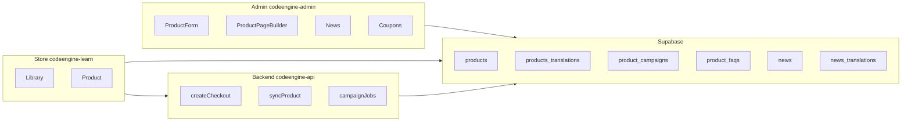
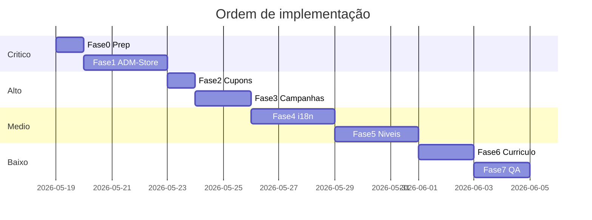

# Plano de ação: ADM 100% funcional → Store espelhada

**Escopo:** 3 repositórios — [codeengine-learn](C:/Users/Dell/Documents/codeengine1.2) (loja), [codeengine-admin](C:/Users/Dell/Documents/codeengine1.2/admin) (ADM), [codeengine-api](C:/Users/Dell/Documents/codeengine1.2/backend) (API/Stripe).

**“Story”** = loja/plataforma do cliente (`src/pages/`, `src/components/product/`). O ADM grava no Supabase; a Store lê via queries + Realtime (parcial).



---

## Diagnóstico resumido (causa raiz)

| Problema reportado | Causa no código |
|-------------------|----------------|
| Tab **Textos** / toggles Layout não refletem na loja | Store ignora `page_layout_config` — tudo hardcoded `true` em [`src/pages/Product.tsx`](src/pages/Product.tsx) L198-203 |
| FAQ/Bônus “desligados” ainda aparecem | [`ProductFAQ.tsx`](src/components/product/ProductFAQ.tsx) e [`ProductBonuses.tsx`](src/components/product/ProductBonuses.tsx) usam **defaults em PT** quando DB vazio |
| **Criar cupom** global não funciona | [`admin/src/pages/Coupons.tsx`](admin/src/pages/Coupons.tsx) é **stub** (botão sem handler) |
| Campanha: preço promocional / Stripe ao terminar | Checkout já lê `special_price` ([`backend/api/stripe/create-checkout.ts`](backend/api/stripe/create-checkout.ts) L119-137); **falta job** para expirar campanha e **sync Stripe** promo→normal |
| Notícias só 1 idioma | [`admin/src/pages/News.tsx`](admin/src/pages/News.tsx) + [`src/pages/News.tsx`](src/pages/News.tsx) sem `news_translations` |
| EN/FR: ficheiro de conteúdo separado | Parcial em [`ProductForm.tsx`](admin/src/components/products/ProductForm.tsx) L474-501; capa/preview não por idioma; flag “mesmo conteúdo 3 línguas” **não existe** |
| FR → utilizador vê inglês | Regra de negócio **não implementada** em [`LocaleContext`](src/contexts/LocaleContext.tsx) / `get_product_localized` |
| Visibilidade por nível (prata, etc.) | **Não existe** schema nem filtro na Library |
| Secções customizadas / “adicionar texto” | [`CustomSectionsManager.tsx`](admin/src/components/products/CustomSectionsManager.tsx) existe mas **não está ligado** ao [`ProductPageBuilder.tsx`](admin/src/pages/ProductPageBuilder.tsx) (sem tab) |
| Módulos curso: link / áudio | [`CurriculumEditor.tsx`](admin/src/components/products/CurriculumEditor.tsx) só upload de vídeo |

---

## Fase 0 — Preparação (0,5 dia)

1. Garantir repos sincronizados e apps a correr localmente:
   - Admin: `cd admin && npm install && npm run dev` (porta 5180)
   - Store: `npm run dev`
   - API: `cd backend && npm install` + `.env.backend`
2. Checklist manual por área do ADM (produtos, builder, notícias, cupons) — documentar erros de consola/RLS.
3. Confirmar variáveis: `VITE_SUPABASE_*` (admin/store), `SUPABASE_SERVICE_ROLE_KEY` (admin), `VITE_BACKEND_URL`, `VITE_ADMIN_API_KEY`.

---

## Fase 1 — Ponte ADM → Store (crítico, 2–3 dias)

**Objetivo:** O que o admin desativa/desliga desaparece na loja; sem placeholders.

### 1.1 Respeitar `page_layout_config` na Store

- Em [`src/pages/Product.tsx`](src/pages/Product.tsx): ler `page_layout_config.sections_enabled` do produto (ou tradução) em vez de constantes `true`.
- Mapear chaves admin → componentes: `faq`, `bonuses`, `benefits`, `video`, `hero`, `cta`, etc.
- Passar `enabled={false}` ou não renderizar o bloco.

### 1.2 Remover conteúdo fake por defeito

- [`ProductFAQ.tsx`](src/components/product/ProductFAQ.tsx): se `product_faqs` vazio **e** secção desativada → `return null`; se ativada e vazio → mostrar estado vazio (sem `DEFAULT_FAQS`).
- [`ProductBonuses.tsx`](src/components/product/ProductBonuses.tsx): idem para `DEFAULT` bonuses.
- Revisar [`ProductBenefits.tsx`](src/components/product/ProductBenefits.tsx) pelo mesmo padrão.

### 1.3 `custom_copy` por idioma

- Admin: ao salvar tab Textos no builder, persistir também em `products_translations.custom_copy` por `pt`/`en`/`fr` (hoje só `products.custom_copy`).
- Store: merge `custom_copy` da tradução ativa (já parcial em Product.tsx L110).

### 1.4 Realtime / refresh nas tabelas filhas

- Subscrever `product_faqs`, `product_bonuses`, `product_campaigns`, `product_custom_sections` em `Product.tsx` (ou invalidar ao focar), para não exigir F5 após editar no ADM.

### 1.5 Tab “Secções” no ProductPageBuilder

- Adicionar tab **Secções customizadas** com [`CustomSectionsManager`](admin/src/components/products/CustomSectionsManager.tsx) em [`ProductPageBuilder.tsx`](admin/src/pages/ProductPageBuilder.tsx).

**Critério de aceite Fase 1:** Desligar FAQ no Layout → FAQ some na loja; limpar FAQs no admin → não aparecem perguntas padrão em PT.

---

## Fase 2 — Cupões globais (1 dia)

**Objetivo:** Página `/coupons` funcional para cupões de **toda a plataforma**.

1. Implementar [`admin/src/pages/Coupons.tsx`](admin/src/pages/Coupons.tsx) completo (extrair padrão de [`CouponsManager.tsx`](admin/src/components/products/CouponsManager.tsx)):
   - CRUD em `product_coupons` com `product_id IS NULL` (já suportado no checkout L156-165).
   - Campos: código, %/fixo, max uses, valid_from/until, ativo, descrição.
2. Opcional: sync Stripe via `POST /api/stripe/create-coupon` ([`backend/stripe-server.ts`](backend/stripe-server.ts)).
3. Teste E2E: criar cupom global → aplicar em [`CouponInput.tsx`](src/components/product/CouponInput.tsx) → checkout com preço correto.

---

## Fase 3 — Campanhas + Stripe (1–2 dias)

**Objetivo:** Preço promocional durante campanha; volta ao preço normal no Stripe quando termina.

1. **Não alterar** `products.price` ao criar campanha (manter `special_price` só em `product_campaigns` — já assim no [`CampaignsManager`](admin/src/components/products/CampaignsManager.tsx)).
2. Backend — novo endpoint/job `POST /api/campaigns/process-expired` (cron ou Supabase Edge Function agendada):
   - Campanhas com `end_date < now` → `is_active = false`.
   - Se existir `stripe_promo_price_id` temporário → arquivar no Stripe e garantir checkout usa `products.stripe_price_id` base.
3. Ao **ativar** campanha com `special_price`: criar Stripe Price promocional (ou `price_data` dinâmico no checkout) e guardar IDs em `product_campaigns` (`stripe_promo_price_id`).
4. UI admin: botão “Sincronizar Stripe” na campanha + estado Agendada/Ativa/Expirada (já parcial no manager).
5. Teste: campanha ativa → preço na página e no checkout iguais; após `end_date` → preço normal.

---

## Fase 4 — i18n produtos e notícias (2–3 dias)

### 4.1 Produtos — conteúdo por idioma

1. **Schema** (migration em `backend/supabase/`):
   - `products.use_shared_content BOOLEAN DEFAULT false`
   - Garantir colunas em `products_translations`: `storage_url`, `cover_url`, `preview_url`, `content`, `custom_copy`
2. **Admin [`ProductForm.tsx`](admin/src/components/products/ProductForm.tsx)**:
   - Por tab PT/EN/FR: blocos separados para capa, preview, ficheiro digital, tipo de conteúdo (livro/filme/curso/vídeo).
   - Checkbox **“Mostrar nas 3 línguas (mesmo conteúdo)”** → `use_shared_content=true`; desativa tabs EN/FR para ficheiros.
3. **Store**: `resolveContentLocale(locale)` — se `locale === 'fr'` → usar conteúdo `en`; se `use_shared_content` → usar ficheiro PT para todos.
4. Atualizar RPC `get_product_localized` (SQL) com essa lógica.
5. [`Library.tsx`](src/pages/Library.tsx): re-fetch ao mudar `locale` (hoje `useEffect([], [])`).

### 4.2 Notícias — 3 línguas

1. Nova tabela `news_translations` (`news_id`, `language`, `title`, `excerpt`, `content`, `slug`).
2. Refatorar [`admin/src/pages/News.tsx`](admin/src/pages/News.tsx): tabs PT/EN/FR como no ProductForm.
3. [`src/pages/News.tsx`](src/pages/News.tsx): carregar tradução por `locale` + fallback EN para FR.

**Critério de aceite:** Utilizador em FR vê UI em francês (i18n JSON) mas **conteúdo** de produto/notícia em inglês; nunca texto PT solto se não escolheu PT.

---

## Fase 5 — Publicação, níveis e prazos (2–3 dias)

**Objetivo:** Publicar conteúdo (rascunho/ativo), restringir por nível, prazos de acesso.

### 5.1 Schema

```sql
-- products
visibility TEXT DEFAULT 'public'  -- 'public' | 'members_only'
min_member_level TEXT NULL        -- NULL = todos; 'silver', 'gold', ...
access_duration_days INT NULL     -- NULL = vitalício após compra

-- member_grants (conteúdo enviado pelo admin sem compra)
id, member_id, product_id, expires_at, granted_by, created_at
```

### 5.2 Admin

- Em [`ProductForm`](admin/src/components/products/ProductForm.tsx) / tabela produtos: controles **Rascunho / Publicar / Arquivar** (já existe `status`; melhorar UX com botões rápidos em [`ProductTable`](admin/src/components/products/ProductTable.tsx)).
- Novos campos: **Público alvo** (todos | nível mínimo) + **Prazo de uso (dias)**.
- Nova página **Membros** (`/members`): listar membros, nível atual, conceder produto com `expires_at` (papel “conseiller” = admin com `can_edit_products` + `can_publish`).

### 5.3 Store

- [`Library.tsx`](src/pages/Library.tsx) + RLS: filtrar produtos `active` onde `visibility` permite o nível do membro (`usePoints` → `currentLevel`).
- Downloads/player: validar `member_grants` e `purchases` com `expires_at`.

**Critério de aceite:** Produto “só prata” invisível para bronze; “publicar para todos” visível para todos.

---

## Fase 6 — Currículo / módulos (1–2 dias)

1. Schema `lessons`: `lesson_type` (`video` | `audio` | `link`), `external_url`, `audio_storage_path`, `parent_course_id` (opcional).
2. [`CurriculumEditor.tsx`](admin/src/components/products/CurriculumEditor.tsx): por aula — tipo, URL externa, upload áudio, nota “acompanha o curso X”.
3. Store [`CourseCurriculum`](src/components/product/CourseCurriculum.tsx) / player: renderizar conforme tipo.

---

## Fase 7 — Testes e estabilização (1–2 dias)

1. Matriz de testes manuais (admin ação → resultado na store).
2. Corrigir RLS se inserts falharem (sintoma comum nos managers).
3. Atualizar docs desatualizados (`TASK_PRODUCT_CUSTOMIZATION_STATUS.md` vs realidade).

---

## Ordem de execução recomendada



**Começar por Fase 1** — maior impacto visível (layout/textos/FAQ/bônus) com menor risco.

---

## Ficheiros-chave por fase

| Fase | Admin | Store | Backend |
|------|-------|-------|---------|
| 1 | `ProductPageBuilder.tsx`, managers | `Product.tsx`, `ProductFAQ.tsx`, `ProductBonuses.tsx` | — |
| 2 | `Coupons.tsx` | `CouponInput.tsx` | `create-checkout.ts` |
| 3 | `CampaignsManager.tsx` | `CampaignBanner.tsx` | novo `campaigns/process-expired.ts`, `sync-product.ts` |
| 4 | `ProductForm.tsx`, `News.tsx`, `translations.ts` | `News.tsx`, `Library.tsx`, `locale` helpers | SQL migrations |
| 5 | `ProductForm.tsx`, nova `Members.tsx` | `Library.tsx`, `useOwnedProducts` | `lib/access.ts` |
| 6 | `CurriculumEditor.tsx`, `curriculum.ts` | `CourseCurriculum.tsx`, players | `lessons/stream.ts` |

---

## Riscos e mitigação

- **RLS Supabase:** testar cada insert com utilizador admin real; usar `supabaseAdmin` no ADM.
- **Stripe prices imutáveis:** nunca sobrescrever `stripe_price_id` base; criar prices novos para promo e arquivar ao expirar.
- **Docs contraditórios** (“100% completo” vs bugs reais): confiar no código acima, não em `PRODUCT_CUSTOMIZATION_COMPLETE.md`.
